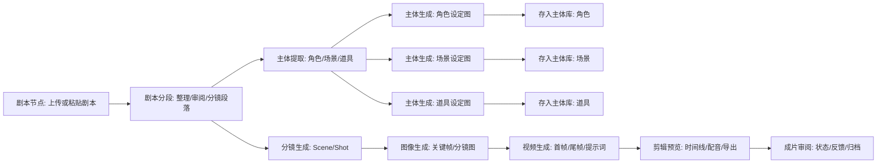
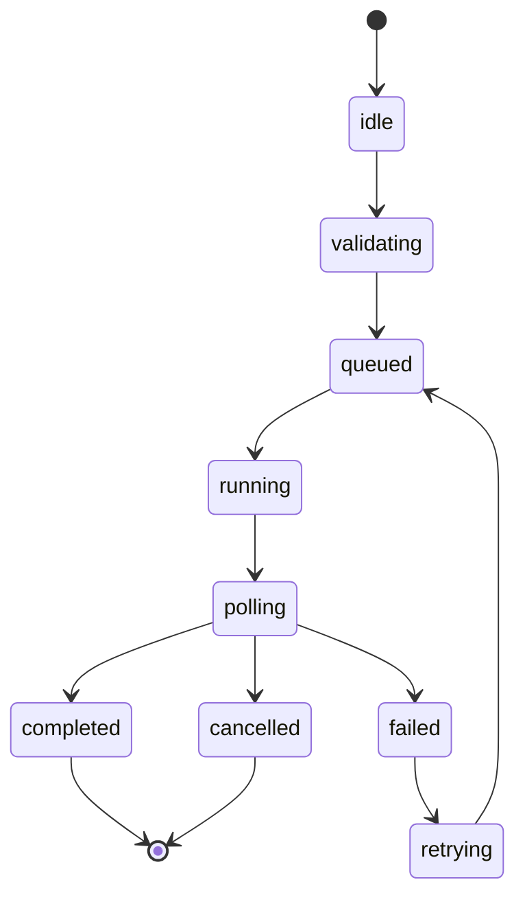
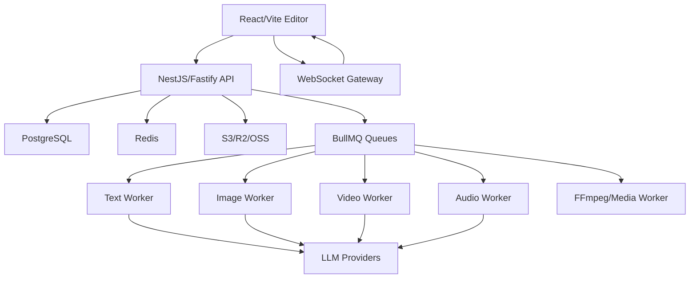

# AI 短剧协作平台 PRD 与技术设计文档（Academy P0 完整合并版）

- 合并时间戳：20260701-165412
- 基础文档：`work/AniShort-like-PRD-technical-design.md`
- 合并来源：`work/academy-av-deep-audit-20260701-134944/AniShort-PRD-detailed-integration-from-academy-AV-20260701-163905.md`
- 说明：本文件保留原 PRD 全文，并在文末追加 Academy P0 AV 深度审查后的详细补强章节；因此它是完整主文档候选，不是摘要或增量包。
- 后续合并方式：可逐章把文末“Academy P0 详细补强”内容迁移回对应原章节，迁移完成后再删除文末附录。

---

# AI 短剧协作平台 PRD 与技术设计文档

版本：v0.1
日期：2026-07-01
定位：面向短剧、短片、广告、系列剧、电影等内容的 AI 影视创作协作平台。本文档基于对 AniShort 在线编辑器、页面 DOM、前端资源名与可见配置的检查进行产品拆解。由于原站属于用户所在公司项目，且用户已明确授权，本项目允许在公司授权范围内复用原站代码、素材、品牌、图标、样式文件、内置提示词和实现细节；复用时需要记录来源、权限边界和必要改造点。

## 1. 产品概述

### 1.1 产品目标

构建一个从“剧本输入”到“主体设定、分镜、图像、视频、剪辑、成片审阅”的一体化 AI 短剧生产平台。核心形态是无限画布 + 节点编排 + AI 助手 + 3D 导演台 + 剪辑时间线 + 成片审阅。

平台需要解决的问题：

- 把短剧制作拆成可复用、可协作、可追踪的节点工作流。
- 在同一画布内串联文本、主体、风格、图像、视频、音频、3D 场景和批处理任务。
- 通过全局风格、主体库、参考素材和节点连线保证角色、场景、道具、画面风格的一致性。
- 支持多模型路由，按质量、速度、价格和任务类型选择文本/图像/视频/音频模型。
- 支持团队协作、版本历史、资源备份、成片审阅和生产过程追踪。

### 1.2 用户角色

| 角色 | 核心诉求 | 高频行为 |
| --- | --- | --- |
| 编剧/策划 | 快速整理剧本、拆分场景、强化钩子 | 输入剧本、剧本分段、审阅、改写 |
| AI 美术/设定师 | 稳定角色、场景、道具、风格 | 主体提取、设定图生成、主体库管理 |
| 分镜导演 | 从剧本生成镜头与画面 | 分镜段落、镜头角度、3D 导演台、图像生成 |
| 视频生成师 | 从画面/提示词生成视频 | 首帧/尾帧、视频模型选择、批量生成 |
| 剪辑师 | 组织素材、配音、成片输出 | 时间线剪辑、旁白配音、导出 |
| 制片/审核 | 管理项目进度与质量 | 成片审阅、状态流转、版本对比 |
| 团队管理员 | 管理人员、额度、模型成本 | 权限、协作席位、积分/额度、审计 |

### 1.3 产品边界

P0 目标：

- 完成无限画布和核心节点工作流。
- 完成文本/图像/视频任务生成、轮询、结果回写。
- 完成主体库、全局风格、资源库、项目/画布管理。
- 完成基础 3D 导演台和剪辑预览。

P1 目标：

- 完成批量生成、音频节点、成片审阅、协作锁、版本历史。
- 完成多模型成本/积分计费与任务队列优化。
- 完成 3D 世界/Gaussian Splat/全景背景和角色骨骼动作。

P2 目标：

- 自动化生产流水线、AI 助手 Action Plan、质量审查、模型效果对比、模板市场。

## 2. 信息架构

### 2.1 顶层导航

编辑器页包含三大工作区：

1. 创作画布
   - 无限画布。
   - 节点库。
   - 节点详情面板。
   - 主体库、资源备份、全局风格、保存/协作锁。
   - Ani 创作助手。

2. 剪辑预览
   - 素材库。
   - 多轨时间线。
   - 生成视频面板。
   - 配音/旁白/音频选择。
   - 播放预览与导出。

3. 成片审阅
   - 剧集/成片列表。
   - 状态筛选：全部、待审、已通过等。
   - 播放审阅页。
   - 状态更新、删除、重新生成入口。

顶部全局区：

- 工作空间入口。
- 项目名/团队名。
- 同步状态。
- 额度/积分入口。
- 分享与协作。
- 下载/导出。

### 2.2 创作画布布局

| 区域 | 功能 |
| --- | --- |
| 左侧面板 | 画布列表、搜索画布、版本历史、复制/重命名画布、节点列表、节点搜索、隐藏/定位节点、清空节点 |
| 中央画布 | React Flow 无限画布、节点、连线、缩放、拖拽、框选、对齐参考线、右键菜单 |
| 底部控制条 | 输入模式、缩放比例、选择/移动、适应视图、隐藏连线、对齐参考线、快捷键、添加节点、主体库、资源备份、全局风格 |
| 右侧面板 | 当前选中节点的配置、执行按钮、模型选择、深度思考、输出预览 |
| 右下角 | Ani 创作助手入口 |
| 右上角浮层 | 保存、协作锁/解锁、协作者状态 |

## 3. 核心创作流程

### 3.1 标准短剧生产流



### 3.2 默认画布初始化

新项目或示例画布建议默认创建：

- 剧本节点。
- 剧本分段节点。
- 主体提取节点。
- 图像生成节点。
- 视频生成节点。
- 文本节点。

默认连线建议：

- 剧本节点 -> 剧本分段。
- 剧本分段 -> 主体提取。
- 剧本分段/主体库 -> 图像生成。
- 图像生成 -> 视频生成。

### 3.3 主体生产推荐流

主体提取完成后，系统应给出引导：

1. 生成角色图像。
2. 存入主体库：角色。
3. 生成场景图像。
4. 存入主体库：场景。
5. 生成道具图像。
6. 存入主体库：道具。
7. 进入分集/分镜制作阶段。

此流程的关键约束：

- 主体生成是第一阶段工作，不应在分集画布重复执行。
- 角色、场景、道具应使用统一命名口径。
- 已存入主体库的主体应避免重复提取和重复生成。

### 3.4 原站案例核验到的真实创作链路

使用 Chrome 检查原站公开案例 `https://anishort.ai/work/275`，点击“查看创作过程”后进入只读 iframe：`/editor/wOj4Io?readonly=true&hideAssistant=false&embedded=true`。可见真实生产画布不是单节点线性流程，而是“文本主线 + 分组批处理 + 场景节点 + 视频节点”的组合。

已确认的生产链路：

1. 剧本节点保存片名、结构、角色、旁白、核心分镜脚本。
2. 剧本分段节点包含三个子能力：剧本整理、剧本审阅、分镜段落，并展示“保留旁白”等配置。
3. 主体提取节点执行主体库校验，案例中显示主体库已有 21 个主体。
4. 主体生成节点按阶段输出：角色主体全量定义、场景主体多视图生成、道具主体三视图生成。
5. 画布存在角色生成组、场景生成组、道具生成组和智能混合分镜组，分组节点提供“整组执行”入口。
6. 分镜生成节点接收剧本分段和主体提取，输出 Scene/Shot、九宫格/四宫格图像提示词、视频提示词、旁白、负面排除提示词和音画同步规范。
7. 案例中生成 Scene01 到 Scene14，每个 Scene 后接视频生成节点；旁白单独由“旁白声音”音频节点承载。
8. 只读模式下底部仍展示主体库和资源备份入口，但提示“该画布处于只读状态，只能查看和复制节点”。

因此，复刻实现不能只做“剧本 -> 图像 -> 视频”的最短链路，必须支持：

- 节点分组与整组执行。
- Scene 级节点批量创建。
- 分镜文本与图像/视频提示词的结构化承接。
- 主体库和资源备份在只读/编辑两种权限状态下的差异行为。
- 音频/旁白作为视频生产流程的一等素材。

## 4. 项目与画布管理

### 4.1 工作空间

功能：

- 个人工作空间。
- 团队工作空间。
- 项目列表：创建、复制、归档、搜索。
- 最近访问、我创建、我协作。
- 项目封面、项目名、创建者、更新时间。

数据字段：

- `workspace_id`
- `team_id`
- `project_id`
- `project_name`
- `owner_id`
- `member_roles`
- `last_opened_at`
- `cover_asset_id`

### 4.2 项目

项目包含：

- 多个画布。
- 全局风格。
- 全局画面比例。
- 选中的默认生图模型。
- 主体库。
- 资源库。
- 剪辑数据。
- 审阅剧集。
- 协作/版本历史。

### 4.3 画布

画布功能：

- 新建画布。
- 复制画布。
- 重命名画布。
- 搜索画布/创建者。
- 版本历史。
- 保存当前画布。
- 清空全部节点。
- 视口保存：`x/y/zoom`。
- 节点列表：显示/隐藏、定位、搜索。

画布数据：

```ts
type Canvas = {
  id: string;
  projectId: string;
  name: string;
  nodes: FlowNode[];
  edges: FlowEdge[];
  viewport: { x: number; y: number; zoom: number };
  version: number;
  createdBy: string;
  createdAt: string;
  updatedAt: string;
};
```

### 4.4 保存与协作锁

功能：

- 自动同步状态展示：已同步、同步中、同步失败。
- 手动保存按钮：保存画布节点、边、视口和全局配置。
- 协作锁：
  - 锁定状态：仅当前用户编辑，其他协作者只读。
  - 解锁状态：允许其他协作者编辑。
- 冲突处理：
  - 乐观更新。
  - 版本号校验。
  - 后端返回冲突时提示用户选择覆盖、合并或另存副本。

## 5. 无限画布交互

### 5.1 基础操作

| 操作 | 说明 |
| --- | --- |
| 选择模式 | 快捷键 V，选择/框选节点 |
| 移动画布 | 快捷键 H，拖动画布视口 |
| 适应视图 | 快捷键 F，视口自适应全部节点 |
| 隐藏连线 | 快捷键 G，切换边显示 |
| 对齐参考线 | 快捷键 `\`，拖动节点时显示参考线 |
| 添加节点 | 快捷键 Tab，打开节点库 |
| 缩放 | 鼠标模式滚轮缩放；触摸板模式双指平移 |
| 右键菜单 | 自由创作、添加节点、粘贴、连线粘贴 |

### 5.2 节点操作

- 拖拽移动。
- 框选多选。
- 删除。
- 复制/粘贴。
- 连线粘贴。
- 打组/解组。
- 对齐：左、右、顶、底、水平居中、垂直居中、水平分布、垂直分布。
- 隐藏/显示。
- 定位。
- 星标。
- 全屏预览/编辑。
- 下载生成结果。

### 5.3 连线与数据类型

建议定义节点端口数据类型：

| 数据类型 | 用途 |
| --- | --- |
| `text` | 剧本、提示词、分镜文本 |
| `script` | 原始剧本或整理后剧本 |
| `subjectList` | 主体提取结果 |
| `style` | 风格提示词 |
| `image` | 图片 URL/资源对象 |
| `video` | 视频 URL/资源对象 |
| `audio` | 音频 URL/音色对象 |
| `model3d` | 3D 模型或场景对象 |
| `camera` | 镜头/相机参数 |

连线校验：

- 文本可接入剧本分段、主体提取、图像生成、视频生成。
- 风格可接入图像生成、视频生成。
- 图片可接入视频生成的首帧/尾帧/参考图。
- 主体库条目可接入图像/视频/3D 节点。
- 3D 导演台输出可接入图像生成或视频生成。

## 6. 节点库设计

### 6.1 节点库入口

可见一级入口：

- 上传素材，快捷键 I。
- 文本节点。
- 图像节点。
- 视频节点。
- 3D 导演台，标记 NEW，显示 5 个子能力。
- 3D 世界，标记 NEW，显示 3 个子能力。
- 画面风格，快捷键 S。
- 音频节点，快捷键 A。
- 批量生成，快捷键 B。
- 粘贴，快捷键 Cmd+V。
- 连线粘贴，快捷键 Cmd+Shift+V。

### 6.2 完整节点类型清单

基于页面可见入口和前端节点标签，应复刻以下节点：

| 分类 | 节点 | 功能定位 |
| --- | --- | --- |
| 基础 | 上传素材 | 导入图片、视频、音频、文档，作为资源节点 |
| 基础 | 剧本节点 | 输入/上传原始剧本，作为文本源 |
| 基础 | 文本节点 | 自由文本、提示词、便签、改写结果 |
| 剧本 | 剧本分段 | 整理剧本、审阅剧本、生成分镜段落 |
| 剧本 | 剧本优化 | 对剧本做改写、增强、节奏调整 |
| 剧本 | 剧本解析 | 提取剧情结构、角色、场景、事件 |
| 主体 | 主体提取 | 从剧本提取角色、场景、道具 |
| 主体 | 主体生成 | 批量生成角色/场景/道具设定图 |
| 主体 | 主体提取简版 | 快速提取主体名称与基础描述 |
| 分镜 | 分镜生成 | 生成 Scene/Shot 结构 |
| 视觉 | 图像生成 | 文生图、图生图、风格/参考图生成 |
| 视觉 | 镜头角度 | 基于图像生成不同机位/景别 |
| 视觉 | 全景生成 | 生成全景背景或环境图 |
| 视觉 | 打光生成 | 生成或修正电影级光影 |
| 视觉 | 画面风格 | 风格提示词、风格库、全局风格 |
| 视觉 | 图片调色 | 色彩校正、LUT、统一色调 |
| 视觉 | 局部重绘 | 局部蒙版重绘、替换局部元素 |
| 视觉 | 图像编辑器 | 裁剪、擦除、扩图、抠像、增强 |
| 视频 | 视频生成 | 图生视频、文生视频、首尾帧生成 |
| 视频 | 视频超分/超分高清 | 视频增强、分辨率提升 |
| 视频 | 字幕擦除 | 擦除视频字幕/水印类文字 |
| 音频 | 声音生成 | 配音、音乐、音效、音色克隆 |
| 批处理 | 批量生成 | 多图/多视频排队、重试、停止 |
| 批处理 | 批量改图 | 多图统一提示词/参数生成 |
| 批处理 | 批处理任务 | 管理批处理状态、队列、进度 |
| 3D | 3D 导演台 | 3D 场景、角色、相机、动作、输出 |
| 3D | 3D 世界 | Gaussian Splat/SPZ/全景世界节点 |
| 剪辑 | 剪辑素材 | 把素材送入剪辑时间线 |
| 对照 | 文字分镜对照 | 文本和镜头/分镜双栏对照 |
| 组织 | 文本便签/便签 | 非生成性说明、备注 |
| 组织 | LUT 对比 | 不同调色/风格效果对比 |
| 高级 | 嵌套输入/嵌套输出 | 支持子画布/节点组合封装 |

### 6.3 节点规格矩阵

节点实现必须以 `nodeId` 作为 PRD 与 WBS 的唯一对齐字段。UI 展示名允许多语言、别名和历史迁移，但开发任务、测试用例、验收报告必须引用下表中的 `nodeId`。

| nodeId | 原站 NodeType/实现 | UI 名称/别名 | 分类 | 输入 | 输出 | 主要操作 | 推荐模型/技术 | WBS 阶段 |
| --- | --- | --- | --- | --- | --- | --- | --- | --- |
| `media-import-node` | `MEDIA_IMPORT` / `MediaImportNode` | 上传素材、参考素材 | 基础 | 本地图片、视频、音频、文档 | `image`、`video`、`audio`、`text`、素材引用 | 上传、重命名、收藏、作为参考连接、视频/音频裁剪 | 对象存储、缩略图、转码 | Phase 3/5/10 |
| `input-node` | `INPUT` / `InputNode` | 剧本节点、输入节点 | 基础 | 粘贴文本、上传文档 | `script`、`text` | 上传剧本、剧本拆分、主体生成、分镜生成 | DeepSeek V4 Flash、Qwen 3.5 | Phase 3/4 |
| `text-node` | `TEXT` / `TextNode` | 文本节点、文案节点 | 基础 | 自由文本、提示词、备注 | `text` | 编辑、AI 生成、连接图像/视频/分镜 | 文本模型、多模态模型按下游决定 | Phase 3/4 |
| `story-optimize-node` | `STORY_OPTIMIZE` / `StoryOptimizeNode` | 剧本分段、剧本优化 | 剧本 | 剧本、文本、主体设定 | 分段剧本、审阅稿、Scene 段落 | 剧本整理、剧本审阅、分镜段落、时长匹配 | DeepSeek V4 Flash，复杂用 Qwen/Gemini | Phase 4 |
| `script-optimize-node` | `SCRIPT_OPTIMIZE` / `ScriptOptimizeNode` | 剧本解析、脚本优化 | 剧本 | 剧本节点、文本节点、剧本分段 | 优化脚本、结构化剧情 | 优化脚本、角色分析、场景分析、分镜化输出 | DeepSeek V4 Pro、Qwen 3.5 Plus | Phase 4 |
| `setting-gen-node` | `SETTING_GEN` / `SettingGenNode` | 主体生成、主体提取、设定生成 | 主体 | 剧本、剧本解析、文本补充、主体提取简版 | 主体设定文本、角色/场景/道具生成入口 | 提取主体、角色生成、场景生成、道具生成、入主体库 | DeepSeek V4 Flash + 图像模型 | Phase 4/6 |
| `subject-extract-lite-node` | `SUBJECT_EXTRACT_LITE` / `SubjectExtractLiteNode` | 主体提取简版、主体提取 | 主体 | 剧本分段、文本 | 角色/场景/道具名称和基础可见特征 | 快速提取、主体库名称对齐 | 默认 `deepseek-v4-flash` | Phase 4 |
| `storyboard-gen-node` | `STORYBOARD_GEN` / `StoryboardGenNode` | 分镜生成、影视脚本 | 分镜 | 剧本、剧本解析、主体库、文本补充 | Scene/Shot、图像提示词、视频提示词 | 生成影视脚本、拉取主体、批量生成分镜图、停止批量 | DeepSeek V4 Pro、Qwen 3.5 Plus | Phase 4/5 |
| `output-node` | `OUTPUT` / `OutputNode` | 图像生成、生图节点 | 视觉 | 文本提示词、参考图、风格、主体素材 | 图片、历史版本、主体库素材 | 生成图片、扩图、抠像、入主体库、打开精修 | Banana Pro、Banana 2.0、Seedream、Midjourney、GPT-image | Phase 5/6 |
| `video-node` | `VIDEO` / `VideoNode` | 视频生成 | 视频 | 提示词、首帧、尾帧、参考图、音频 | 视频、缩略图、历史版本、剪辑素材 | 生成视频、拉取提示词、提示词预检测、一键改写 | Seedance 2.0、可灵、VEO、Sora、Vidu | Phase 5/10 |
| `style-node` | `STYLE` / `StyleNode` | 画面风格、风格节点 | 视觉 | 图片参考、风格文本 | `style`、风格提示词 | AI 生成风格词、设为全局风格、加入风格库 | 文本/多模态模型 | Phase 6 |
| `audio-gen-node` | `AUDIO_GEN` / `AudioGenNode` | 声音生成、音频节点、旁白声音 | 音频 | 角色信息、文字、音频参考、音乐提示词 | 音频文件、音色配置、剪辑声音素材 | 生成声音、克隆音色、生成音乐、下载音频 | TTS、Voice Clone、Music Gen | Phase 5/10 |
| `batch-gen-node` | `BATCH_GEN` / `BatchGenNode` | 批量生成、批量队列 | 批处理 | 多个图像/视频节点、批量配置 | 执行进度、批量结果 | 开始、暂停、停止、移除、重试、敏感词改写 | 队列、并发限制、成本预估 | Phase 7 |
| `batch-processor-node` | `BATCH_PROCESSOR` / `BatchProcessorNode` | 批处理任务、批量改图 | 批处理 | 多张参考图、统一提示词、统一参数 | 结果集、进度 | 批量生成、停止批量、更新配置 | 默认继承模型/比例/分辨率 | Phase 7 |
| `camera-angle-node` | `CAMERA_ANGLE` / `CameraAngleNode` | 镜头角度、视角调整 | 视觉 | 已有图片、参考图、镜头配置 | 角度变体图片、历史版本 | 调整旋转、倾斜、缩放、广角、生成角度变体 | 图像模型 + `camera_angle_config` | Phase 5/6 |
| `panorama-gen-node` | `PANORAMA_GEN` / `OutputNode` 模式 | 全景生成 | 视觉/3D | 文本、参考图、场景图 | 21:9 全景图、HDRI/环境参考 | 生成 360x180 全景、作为 3D 环境 | Banana Pro，隐藏全景 Prompt | Phase 5/9 |
| `lighting-gen-node` | `LIGHTING_GEN` / `OutputNode` 模式 | 打光生成 | 视觉 | 已有图片、光照描述 | 重新打光图片 | 生成不同光照、保留主体结构 | 图像模型 + `relightMode` | Phase 5/6 |
| `image-redraw-node` | `IMAGE_REDRAW` / `ImageRedrawNode` | 局部重绘 | 视觉 | 源图、蒙版、提示词 | 重绘图片、历史版本 | 绘制蒙版、局部生成、停止、重试 | Banana Pro/Flash，VIP fast mode | Phase 5/6 |
| `image-refiner-node` | `IMAGE_REFINER` / `ImageRefinerNode` | 图像编辑器、图像优化 | 视觉 | 源图、编辑画布、图层数据 | 精修图片、图层缓存 | 打开编辑器、局部编辑、裁剪、擦除、扩图 | Canvas/Fabric/Konva + 图像模型 | Phase 5/6 |
| `image-color-grade-node` | `IMAGE_COLOR_GRADE` / `ImageColorGradeNode` | 图片调色 | 视觉 | 源图 | 调色后图片、历史版本 | 调整 lift/gamma/gain/offset、色温、色相、对比、饱和等 | WebGL/Canvas 本地处理 | Phase 6 |
| `lut-compare-node` | `LUT_COMPARE` / `LutCompareNode` | LUT 对比 | 视觉 | 源图、`.cube` LUT、内置 LUT | LUT 预览图、对比结果 | 上传/选择 LUT、强度、分割线对比、应用 | `.cube` parser + WebGL | Phase 6 |
| `video-upscale-node` | `VIDEO_UPSCALE` / `VideoNode` 模式 | 视频超分、超分高清 | 视频后期 | 视频 | 超分视频 | 选择分辨率、倍率、模型、提交处理 | `视频超分` / Starlight Precise 2.5 | Phase 5/10 |
| `subtitle-erase-node` | `SUBTITLE_ERASE` / `VideoNode` 模式 | 字幕擦除 | 视频后期 | 视频 | 去字幕/去水印视频 | 擦除字幕/水印、轮询处理任务 | `SmartSub_Video` | Phase 5/10 |
| `clip-material-node` | 视频裁剪工具 + `MEDIA_IMPORT` 输出 | 剪辑素材 | 剪辑 | 视频、start/end | 裁剪后视频素材 | 选择范围、保存剪辑素材、进入时间线 | 浏览器裁剪 + 转码/上传 | Phase 10 |
| `text-storyboard-node` | `TEXT_STORYBOARD` / `TextStoryboardNode` | 文字分镜对照 | 对照 | 原文、优化文本 | 对照文本、下游 `text` | 原文/优化稿对照、差异查看、输出文本 | 文本 diff/富文本 | Phase 4 |
| `note-node` | `NOTE` / `NoteNode` | 文本便签、便签 | 组织 | 自由文本、协作说明 | 备注、流程提示 | 编辑内容、改颜色、改宽度、删除 | 本地 UI，无生成 | Phase 3 |
| `scene3d-director-node` | `SCENE_3D` / `Scene3DNode` | 3D 导演台 | 3D | 角色、场景、道具、全景/3D 世界 | 构图图、相机参数、场景数据 | 点击编辑 3D 导演台、摆放模型、调相机、导出 | Three.js、TransformControls | Phase 9 |
| `world3d-node` | `WORLD_3D` / `World3DNode` | 3D 世界 | 3D | 文本、图片、全景、素材 | 3D 世界/场景引用 | 生成世界、上传/转换 Gaussian/Splat、作为导演台环境 | Three.js、Splat/SPZ | Phase 9 |
| `nested-input-node` | `NESTED_INPUT` / `NestedInputNode` | 嵌套输入 | 高级 | 外层 text/image/video/audio | 子画布输入 | 同步外部输入、更新数据 | 子画布数据桥 | Phase 3/9 |
| `nested-output-node` | `NESTED_OUTPUT` / `NestedOutputNode` | 嵌套输出 | 高级 | 子画布最终图片/视频 | 外层图片/视频结果 | 同步输出媒体、更新数据 | 子画布数据桥 | Phase 3/9 |
| `group-node` | `GROUP` / `GroupNode` | 分组节点、角色/场景/道具生成组 | 组织 | 多个节点、执行队列 | 局部流程结构、整组执行入口 | 整组执行、停止批量、取消分组 | React Flow group + 批处理 | Phase 3/7 |

实现约束：

- `PANORAMA_GEN` 和 `LIGHTING_GEN` 复用 `OutputNode`，但默认数据、隐藏 Prompt 和模式字段不同。
- `VIDEO_UPSCALE` 和 `SUBTITLE_ERASE` 复用 `VideoNode`，但 `apiConfig.model`、处理接口和默认配置不同。
- `文本便签` 和 `便签` 在原站为 `NOTE` 的展示名/别名，不应拆成两套数据模型。
- `图像编辑器` 是 `IMAGE_REFINER`，`局部重绘` 是 `IMAGE_REDRAW`，两者可以共享图像编辑缓存，但执行条件不同。
- `剪辑素材` 来自视频裁剪保存动作，最终应进入素材库/时间线，不必强行做成独立 React Flow NodeType，除非后续产品确认原站存在独立 NodeType。
- 后续开发若发现原站实际 NodeType 与本表不一致，必须先使用 Chrome/CDP 核验，再同步更新 PRD 与 WBS。

## 7. 节点详细设计

### 7.1 剧本节点

用途：

- 上传文本或在线写作。
- 保存原始剧本、分集文案、短片文案、广告脚本。
- 输出到剧本分段、主体提取、文本节点。

UI：

- 标题：剧本节点。
- 内容区：富文本/纯文本输入。
- 空态：请上传文本或者在线写作。
- 全屏预览。
- 文件上传入口。

输入：

- 粘贴文本。
- 上传文档：txt、md、docx、pdf。
- 可选图片/文档 OCR，MVP 可先只识别文本。

输出：

- `script`。
- `text`。

配置：

- 文本清洗：去格式、去空行、保留换行。
- 字数统计。
- 分集标记识别。
- 角色对白/旁白格式识别。

### 7.2 剧本分段节点

用途：

- 对原始剧本进行结构化整理。
- 支持剧本整理、剧本审阅、分镜段落三种子能力。

子能力：

| 子能力 | 说明 | 启用条件 |
| --- | --- | --- |
| 剧本整理 | 按配置整理原始剧本内容 | 已连接剧本或有文本输入 |
| 剧本审阅 | 对照原文审阅并编辑剧本内容 | 剧本整理完成后 |
| 分镜段落 | 整理成可用于分镜的 Scene 段落 | 剧本审阅/整理完成后 |

项目类型：

- 短剧：强钩子、快节奏、适合竖屏短剧。
- 系列剧。
- 电影。
- 短片。
- 广告。

配置项：

| 序号 | 选项 | 默认 | 推荐 | 功能 |
| --- | --- | --- | --- | --- |
| 01 | 短剧开头钩子 | 开启 | 是 | 强化开头冲突和吸引力 |
| 02 | 短剧结尾钩子 | 开启 | 是 | 结尾留悬念，承接下一集 |
| 03 | 保留对白 | 开启 | 是 | 原台词逐字锁定，不润色、不改写 |
| 03-1 | 允许扩写对白 | 开启 | 否 | 在保留原台词前提下补充少量过渡/反应对白 |
| 04 | 保留旁白 | 开启 | 是 | 保留旁白信息和叙述顺序 |
| 05 | 读取人物设定 | 开启 | 是 | 优化时参考已连接或已有的人物设定 |
| 06 | 优化人物设定 | 关闭 | 否 | 补强人物外观、身份和一致性描述 |
| 07 | 一句话梗概 | 开启 | 是 | 抓住核心冲突与卖点 |
| 08 | 冲突 | 开启 | 是 | 提升戏剧张力和推进力 |
| 09 | 角色 | 开启 | 是 | 强化角色逻辑和一致性 |
| 10 | 人物设定 | 关闭 | 否 | 读取、优化或保存人物设定 |
| 11 | 语气与情绪 | 开启 | 是 | 控制整体语气、情绪和观感 |
| 12 | 类型 | 关闭 | 否 | 明确类型风格和观众预期 |
| 13 | 场景 | 开启 | 是 | 控制场景呈现和空间连续性 |
| 14 | 对白 | 开启 | 是 | 优化对白自然度和人物口吻 |
| 15 | 视觉风格 | 开启 | 是 | 输出稳定视觉表达 |
| 16 | 时代背景 | 关闭 | 否 | 避免时代与设定不一致 |
| 17 | 时长节奏 | 关闭 | 否 | 控制篇幅、节奏和段落密度 |
| 18 | 故事线 | 关闭 | 否 | 控制故事推进和情节结构 |
| 19 | AI 增强 | 关闭 | 否 | 让模型主动增强结构、情绪或表达 |

自定义属性：

- 开关项：只控制是否启用。
- 输入项：启用后提供文本输入。
- 属性应保存为节点配置，进入 Prompt Builder。

模型：

- 默认/推荐：DeepSeek V4 Flash，适合快速整理。
- 高质量：DeepSeek V4 Pro、Qwen 3.5 Plus、Gemini 3.1 Pro。
- 多模态审阅：Gemini 3.1 Flash/Pro。

输出模式：

- 原文输出。
- 2 分钟短剧节奏。
- 原样输出。

执行：

- 深度思考开关。
- 运行中状态：generating。
- 输出可中断、重试。
- 完成后可继续启用“剧本审阅”和“分镜段落”。

### 7.3 主体提取节点

用途：

- 从剧本分段/剧本节点中提取角色、场景、道具。
- 产出主体列表和标准化提示词。
- 与主体库去重校验。

UI：

- 标题：主体提取。
- 按钮：主体库校验。
- 全屏查看。
- 空态：连接剧本后快速提取；提取角色、场景、道具名称和基础外貌特征。
- 右侧面板：
  - 规则输入框。
  - 模型下拉。
  - 深度思考。
  - 提取主体按钮。

规则输入框占位：

- 可补充提取规则，例如需要保留哪些角色、忽略哪些临时物品、命名口径、场景/道具边界。留空则按默认规则提取。

输出格式建议：

```md
## 角色
| id | 名称 | 身份 | 外貌 | 服装 | 性格 | 标准化提示词 |

## 场景
| id | 名称 | 空间 | 时代 | 氛围 | 标准化提示词 |

## 道具
| id | 名称 | 用途 | 外观 | 关联角色/场景 | 标准化提示词 |
```

主体库校验：

- 检查同名主体。
- 检查别名。
- 检查已存在标准化提示词。
- 提供跳过、合并、覆盖、生成新版本。

推荐模型：

- 默认/推荐：DeepSeek V4 Flash。
- 长剧本：Qwen 3.5 Plus、Gemini 3.1 Pro。
- 需要跨语言/表格稳定输出：Gemini 3.1 Pro。

### 7.4 主体生成节点

用途：

- 基于主体提取结果批量生成角色/场景/道具设定图。
- 支持存入主体库。

输入：

- 主体提取结果。
- 全局风格。
- 画面比例。
- 参考图。

功能：

- 生成角色图像。
- 生成场景图像。
- 生成道具图像。
- 存入主体库：角色/场景/道具。
- 支持跳过已存在主体。
- 支持批量重试。

输出：

- 设定图。
- 标准化主体卡片。
- 主体库引用。

### 7.5 分镜生成节点

用途：

- 把剧本分段结果转成可执行的镜头序列。

输入：

- 剧本分段。
- 主体库。
- 全局风格。

输出建议：

```ts
type StoryboardScene = {
  sceneId: string;
  title: string;
  location: string;
  timeOfDay: string;
  emotion: string;
  shots: StoryboardShot[];
};

type StoryboardShot = {
  shotId: string;
  durationSec: number;
  camera: string;
  angle: string;
  composition: string;
  action: string;
  dialogue?: string;
  imagePrompt: string;
  videoPrompt: string;
  subjects: string[];
};
```

功能：

- Scene 拆分。
- Shot 拆分。
- 镜头景别/角度/运动。
- 提示词生成。
- 一键创建图像节点/视频节点。

### 7.6 图像生成节点

用途：

- 生成关键帧、分镜图、角色/场景/道具设定图、海报图。

UI：

- 标题：图像生成。
- 空态：请输入提示词进行图像生成；支持连入风格和参考图。
- 操作：星标、下载图片、全屏预览。

配置：

| 字段 | 默认 | 说明 |
| --- | --- | --- |
| prompt | 空 | 图像提示词 |
| resolution | 2K | 1K/2K/4K 等 |
| aspectRatio | 16:9 | 可继承全局比例 |
| model | Banana Pro | 默认 `gemini-3-pro-image-preview` |
| history | [] | 生成历史 |
| seed | 可选 | 复现用 |
| referenceImages | [] | 参考图 |
| styleRef | 可选 | 风格节点/全局风格 |

模型清单：

| 模型 ID | UI 名称 | 说明 | 建议用途 |
| --- | --- | --- | --- |
| `gemini-3-pro-image-preview` | Banana Pro | 高质量图像模型 | 默认高质量生图 |
| `gemini-3.1-flash-image-preview` | Banana 2.0 | 快速图像模型 | 快速草图/迭代 |
| `doubao-seedream-5-0-260128` | Seedream 5.0 | 即梦图像模型 | 中文语境/商业图 |
| `doubao-seedream-4-5-251128` | Seedream 4.5 | 即梦图像模型 | 成本较低 |
| `Midjourney-v8` | Midjourney-v8 | MJ 风格能力 | 高审美概念图 |
| `Midjourney-v7` | Midjourney-v7 | MJ 风格能力 | 风格探索 |
| `gpt-image-2` | GPT-image2-low | OpenAI 图像模型 | 低成本生成 |
| `gpt-image-2-medium` | GPT-image2-medium | OpenAI 图像模型 | 平衡质量/成本 |
| `gpt-image-2-high` | GPT-image2-high | OpenAI 图像模型 | 高质量编辑/生成 |

快捷命令：

- 多视角九宫格。
- 多视角 25 宫格。
- 剧情推演四格。
- 角色 3+1 视图。
- 电影级光影校正。
- 画面推演：3 秒后。
- 画面推演：5 秒前。

输出：

- 图片 URL。
- 缩略图。
- 使用模型、参数、消耗额度。
- 可作为视频节点首帧/尾帧。

### 7.7 视频生成节点

用途：

- 将图像、提示词、首帧/尾帧、风格、音频生成视频。

UI：

- 标题：视频生成。
- 空态：请输入提示词并连入图像进行视频生成；支持连入首帧尾帧和风格。
- 显示首/尾帧标记。
- 操作：星标、下载视频、全屏预览。

配置：

| 字段 | 默认 | 说明 |
| --- | --- | --- |
| prompt | 空 | 视频提示词 |
| aspectRatio | 16:9 | 可继承全局比例 |
| duration | 4s | 视频时长 |
| resolution | 480p | 可选 480p/720p/1080p |
| sound | on | 是否生成/保留声音 |
| referenceMode | reference | 参考模式 |
| model | Seedance 2.0 | 默认 `doubao-seedance-2-0-260128` |
| firstFrame | 可选 | 首帧图 |
| lastFrame | 可选 | 尾帧图 |
| styleRef | 可选 | 风格引用 |

模型清单：

| 模型 ID | UI 名称 | 说明 | 建议用途 |
| --- | --- | --- | --- |
| `doubao-seedance-2-0-260128` | Seedance 2.0 | 默认视频模型 | 综合质量/速度 |
| `doubao-seedance-2-0-fast-260128` | Seedance 2.0 fast | 快速视频模型 | 批量草稿 |
| `doubao-seedance-1-5-pro-251215` / `seedance` | 即梦 1.5 | 高质量视频模型 | 镜头质感 |
| `kling-v2-6` / `kling` | 可灵 2.6 | 快手视频模型 | 稳定图生视频 |
| `kling-v3` | 可灵 V3 | 新版可灵 | 高质量镜头 |
| `kling-v3-omini` | 可灵 V3 Omini | 全能/多模态方向 | 复杂参考 |
| `kling-v3-motion-control` | 可灵 V3 动作迁移 | 动作控制 | 角色动作复用 |
| `veo3.1` | VEO 3.1 | Google 视频模型 | 高质量场景 |
| `veo3.1-pro` | VEO 3.1 Pro | Google 旗舰视频模型 | 重要成片镜头 |
| `sora-2` | Sora 2 | OpenAI 视频模型 | 电影级镜头探索 |
| `viduq3-pro` | Vidu Q3 Pro | 生数视频模型 | 稳定可控 |
| `viduq3-turbo` | Vidu Q3 Turbo | 生数快速模型 | 快速迭代 |
| `grok-video-3` | Grok Video 3 | xAI 视频模型 | 备选 |
| `wan-2-7` | Wan 2.7 | 阿里万相视频模型 | 中文生态备选 |
| `happyHorse-1.0` | HappyHorse 1.0 | 阿里快乐马视频模型 | 动作/趣味模型 |
| `SmartSub_Video` | 字幕擦除 | 视频处理 | 去字幕/擦除 |

任务流程：

1. 前置校验：prompt、模型、项目、画布、节点 ID、额度。
2. 创建任务记录。
3. 提交模型代理。
4. 节点状态设为 generating。
5. 轮询任务状态。
6. 成功后写入 videoUrl、thumbnail、taskId、model、duration、resolution。
7. 失败后展示 errorMessage，并支持重试/积分返还提示。

### 7.8 文本节点

用途：

- 草稿、提示词、分镜说明、AI 输出暂存。

UI：

- 标题：文本节点。
- 1X/2X/3X 尺寸切换。
- 全屏编辑。
- 双击输入。
- 拖动调整节点大小。

配置：

- 富文本/Markdown。
- 字数统计。
- 文本颜色。
- 宽高。

### 7.9 画面风格节点

用途：

- 管理局部风格提示词。
- 为图像/视频节点提供 `style` 输出。
- 可作为全局风格的局部覆盖。

UI：

- 标题：画面风格。
- 风格文本输入。
- 输出端口：style。

风格库建议：

- 三渲二。
- 3D 国漫。
- 波普艺术风。
- 风格化 3D 动画。
- 宫崎骏风。
- 超写实 3D 动画。
- 3D 动画。
- 奇妙冒险风。
- 皮克斯动画。
- 定格动画。
- 美式硬派。
- 日系恐怖。

提示词获取设计：

- 风格卡片不仅保存展示名，还必须保存 `stylePrompt`。
- 全局风格选择后，允许查看、复制、编辑提示词。
- 若用户只选择内置风格，生成时也应把对应 `stylePrompt` 注入 Prompt Builder。
- 支持自定义全局风格文本 `customGlobalStyleText`，优先级高于风格卡片默认 prompt。

### 7.10 全局风格

当前画布底部会显示当前全局风格，例如“三渲二”。复刻设计：

字段：

```ts
type GlobalStyle = {
  id: string;
  name: string;
  thumbnailUrl?: string;
  prompt: string;
  negativePrompt?: string;
  source: "preset" | "custom" | "imported";
};
```

功能：

- 选择全局风格。
- 查看提示词。
- 复制提示词。
- 自定义风格。
- 从参考图提取风格。
- 应用到全部图像/视频节点。
- 单节点覆盖。
- 保存在项目级，而非单画布级。

优先级：

1. 节点本地风格。
2. 连入的画面风格节点。
3. 项目全局风格。
4. 默认无风格。

### 7.11 音频节点

用途：

- 配音、旁白、背景音乐、音效、音色克隆。

能力：

- 生成声音。
- 克隆音色。
- 生成音乐。
- 下载音频。
- 输出到剪辑时间线或视频生成。

输入：

- 角色信息。
- 音频参考。
- 文字描述。
- 音乐提示词。

输出：

- 音频文件。
- 音色配置。
- 可用于视频或剪辑的声音素材。

注意：

- 角色未定型前过早配音容易返工。
- 参考音频质量会影响克隆效果。

### 7.12 批量生成节点

用途：

- 管理多节点批量执行、重试、停止。

能力：

- 批量图像生成。
- 批量视频生成。
- 批量改图。
- 批量重试。
- 暂停/停止。
- 显示队列进度。

规则：

- 前置节点未准备好时不可批量执行。
- 单个失败不阻塞全队列。
- 支持失败原因归类：安全审核、余额不足、模型超时、网络错误、格式异常。

### 7.13 上传素材/媒体节点

用途：

- 上传或导入图片、视频、音频、文档。

约束：

- 图片/文档：最多 5 个，每个 10 MB。
- 视频：建议 50 MB。
- 上传附件默认仅识别文字，视频可作为素材引用。

输出：

- 图片：`image`。
- 视频：`video`。
- 音频：`audio`。
- 文档：`text`。

### 7.14 3D 导演台节点

画布节点本体：

- 标题：3D 导演台。
- 核心按钮：点击进入 3D 导演台。
- 进入后节点显示“3D 导演台已全屏打开，按 ESC 或点击右上角退出返回”。

用途：

- 在 3D 空间内摆放角色、场景、相机。
- 调整镜头、景别、构图、动作。
- 输出构图图、相机参数、视频参考。

### 7.15 剧本解析、主体提取简版与文字分镜对照

剧本解析节点 `script-optimize-node`：

- 原站实现：`SCRIPT_OPTIMIZE` / `ScriptOptimizeNode`。
- 可接受上游：`INPUT`、`TEXT`、`STORY_OPTIMIZE`。
- 必需上游：剧本、文本或剧本分段；无上游时按钮禁用并提示缺少原始脚本。
- 主要按钮：优化脚本、角色分析、场景分析、分镜化输出。
- 输出：优化后的脚本、结构化剧情、角色/场景分析结果，可继续连到主体生成或分镜生成。
- 适用场景：原始剧本文字松散、需要先做镜头化表达、剧情结构和人物关系整理。
- 非必经节点：短流程可以直接从剧本分段进入主体生成和分镜生成。

主体提取简版 `subject-extract-lite-node`：

- 原站实现：`SUBJECT_EXTRACT_LITE` / `SubjectExtractLiteNode`。
- 默认模型：`deepseek-v4-flash`。
- 默认宽高：`780 x 760`。
- 默认字段：`label: 主体提取`、`value`、`prompt`、`model`、`items`、`status`。
- 默认提取规则：按角色、场景、道具三类提取主体；主体名称必须保留剧本文本中的完整专名，不得缩短、泛化或使用示例占位名；只输出名称和基础可见外貌/视觉特征，不输出性格、关系、剧情功能、镜头语言或完整设定；优先沿用主体库已有名称，忽略不影响视觉一致性的临时物品和纯背景装饰。
- 输出结构：`items[]`，每项包含 `type`、`name`、`visualFeature`、`sourceText`、`libraryMatchedSubjectId`。
- 主要用途：快速给分镜/主体生成提供最小主体清单。
- 与主体生成的关系：主体提取简版偏“轻量清单”，主体生成节点偏“完整设定 + 图像生成入口 + 主体库入库”。

文字分镜对照 `text-storyboard-node`：

- 原站实现：`TEXT_STORYBOARD` / `TextStoryboardNode`。
- 默认字段：`originalText`、`optimizedText`、`status`。
- 默认尺寸：`420 x 520`。
- 输入端口：优化文本/原始文本。
- 输出端口：`text`。
- UI：原文/优化稿双栏或 Tab，对比字数、增删差异、接收中/加载中状态、错误遮罩。
- 用途：审阅剧本分段、分镜脚本改写前后差异，并把确认后的文本继续送到图像/视频节点。

### 7.16 图像工具节点

镜头角度 `camera-angle-node`：

- 原站实现：`CAMERA_ANGLE` / `CameraAngleNode`。
- 默认配置：`rotation: 0`、`tilt: 0`、`zoom: 5`、`wideAngle: false`。
- 输入：已有图片或参考图。
- 输出：新的角度变体图和历史版本。
- 按钮：生成角度变体、调整旋转、调整倾斜、调整广角。
- 校验：无参考图时不可执行；该节点用于精修和镜头实验，不作为项目起点。

全景生成 `panorama-gen-node`：

- 原站实现：`PANORAMA_GEN`，复用 `OutputNode`。
- 默认配置：`resolution: 2K`、`aspectRatio: 21:9`、`denoisingStrength: 0.7`、`panoramaMode: true`、`isPanoramaGenerated: true`。
- 隐藏 Prompt：原站内置 `PANORAMA_REFERENCE_TEMPLATE_PROMPT`，要求生成无缝 `360 x 180` equirectangular HDRI panorama，并在有参考图时以参考图 1 的地点、建筑、墙面、地面、天花板、材质、颜色、光线和氛围作为最高优先级。
- PRD 要求：高级设置中允许查看、复制、编辑该隐藏 Prompt；默认可折叠，避免普通用户误改。
- 输出：全景图、3D 导演台环境图、3D 世界背景参考。
- 校验：输出宽高比应接近 `2:1`；非全景图进入 3D 导演台时需要提示效果风险。

打光生成 `lighting-gen-node`：

- 原站实现：`LIGHTING_GEN`，复用 `OutputNode`。
- 默认配置：`relightMode: true`、`resolution: 2K`、`aspectRatio: Auto`、`denoisingStrength: 0.7`。
- 输入：已有图片和光照描述。
- 输出：重新打光后的图片。
- 常见用途：日夜切换、电影级侧逆光、补轮廓光、统一场景光影。
- 校验：必须有上游图片；提示词应限制“保留构图和主体结构”。

局部重绘 `image-redraw-node`：

- 原站实现：`IMAGE_REDRAW` / `ImageRedrawNode`。
- 默认字段：`prompt`、`sourceImageUrl`、`maskImageUrl`、`maskPreviewUrl`、`imageUrl`、`resolution: 2K`、`aspectRatio: 1:1`、`fastMode: false`、`history`。
- 可用模型：`gemini-3-pro-image-preview` 和 `gemini-3.1-flash-image-preview`；快速模式可映射为 `-vip` 请求模型。
- 输入：源图、蒙版、局部修改提示词。
- 输出：重绘结果图。
- 校验：没有源图提示“请先连接原图”；没有蒙版提示先涂抹重绘区域。

图像编辑器 `image-refiner-node`：

- 原站实现：`IMAGE_REFINER` / `ImageRefinerNode`。
- 默认字段：`label: 图像编辑器`、`status: idle`、`refImageUrl`。
- 缓存字段：`canvasJSON`、`layersData`，用于保存编辑画布和图层。
- 输入：源图。
- 输出：编辑后的图像或可继续精修的版本。
- 功能：打开图像编辑器、裁剪、擦除、扩图、局部编辑、保存图层。
- 实现建议：编辑器缓存应被画布历史系统特殊处理，避免大体积 data URL 导致快照膨胀。

图片调色 `image-color-grade-node`：

- 原站实现：`IMAGE_COLOR_GRADE` / `ImageColorGradeNode`。
- 默认字段：`sourceImageUrl`、`imageUrl`、`grade`、`history`。
- 调色参数：`lift`、`gamma`、`gain`、`offset`、`temp`、`tint`、`contrast`、`pivot`、`colorBoost`、`saturation`、`hue`、`shadows`、`highlights`、`lumMix`。
- 默认值：`contrast: 1`、`pivot: 0.435`、`saturation: 1`、`lumMix: 1`，其他颜色轮和偏移为中性。
- 特性：本地实时预览，无 AI 任务；可保存为新图片版本。

LUT 对比 `lut-compare-node`：

- 原站实现：`LUT_COMPARE` / `LutCompareNode`。
- 默认字段：`sourceImageUrl`、`imageUrl`、`lutUrl`、`lutName`、`presetKey: identity`、`strength: 1`、`splitX: 0.5`、`history`。
- 输入：源图、`.cube` LUT 文件或内置 LUT。
- 输出：套用 LUT 后的预览和可保存结果。
- 交互：左右分割对比、强度滑杆、预置选择、上传 LUT。
- 技术：解析 `.cube`，用 WebGL/Canvas shader 进行预览。

### 7.17 视频后期与剪辑素材节点

视频超分 `video-upscale-node`：

- 原站实现：`VIDEO_UPSCALE`，复用 `VideoNode`。
- 默认字段：`videoEnhanceMode: true`、`resolution: 480p`、`duration: 5`、`videoEnhanceConfig.resolution: 480p`、`videoEnhanceConfig.style: animation`、`upscaleModel: Starlight Precise 2.5`、`upscaleMultiplier: 2`、`apiConfig.model: 视频超分`。
- 输入：视频 URL。
- 输出：超分视频 URL、分辨率、处理任务 ID。
- 任务：提交处理任务、轮询状态、失败归类、成功转存资源库。
- 校验：只接受远程或已上传视频；本地 blob 需先上传。

字幕擦除 `subtitle-erase-node`：

- 原站实现：`SUBTITLE_ERASE`，复用 `VideoNode`。
- 默认字段：`videoEnhanceMode: true`、`videoWatermarkRemovalMode: true`、`resolution: 1080p`、`duration: 5`、`config.prompt: 擦除视频中的字幕/水印`、`apiConfig.model: SmartSub_Video`。
- 输入：视频。
- 输出：去字幕/去水印视频。
- 交互：选择擦除区域或自动检测，提交后展示处理进度。
- 风险：该能力用于公司内部授权素材处理；后续上线需增加版权/授权提示。

剪辑素材 `clip-material-node`：

- 原站观察：剪辑素材主要来自视频节点/素材节点的裁剪保存动作，提示“正在保存剪辑素材”“剪辑素材已保存”。
- 输入：视频、起始时间、结束时间。
- 输出：裁剪后 `webm/mp4` 文件、时长、start/end 元数据、素材库记录。
- 交互：进入裁剪模式、拖动范围、空格播放、方向键微调、Enter 保存。
- 技术：浏览器端裁剪可用 WebCodecs/FFmpeg.wasm 或后端转码；保存后上传对象存储并自动进入剪辑预览素材库。

### 7.18 音频、批处理、分组与嵌套节点

声音生成 `audio-gen-node`：

- 输入：角色信息、音频参考、文字描述、音乐提示词。
- 输出：音频文件、音色配置、可用于视频或剪辑的声音素材。
- 按钮：生成声音、克隆音色、生成音乐、下载音频。
- 场景：角色配音、旁白声音、背景音乐、音效、音色预设。
- 案例核验：原站真实画布中“旁白声音”作为单独音频节点存在，和 Scene 视频节点并行服务剪辑阶段。

批量生成 `batch-gen-node`：

- 管理对象：多个图像节点、视频节点或分镜生成出的 Scene 节点。
- 按钮：开始批量、暂停批量、停止批量、移除任务、失败重试。
- 必须展示：总任务数、进行中、成功、失败、暂停、预计消耗、已消耗。
- 原站能力描述包含“违规词改写”，因此失败归类中需要包含敏感词/审核失败，并提供一键改写后重试。

批处理任务 `batch-processor-node`：

- 默认字段：`label: 批处理任务`、`prompt`、`status`、`resolution: Inherit`、`aspectRatio: Inherit`。
- 输入端口：图片输入、参考图输入。
- 输出：一组处理结果和进度。
- 用途：批量改图、统一风格重绘、统一参数生成。
- 交互：统一提示词、继承/覆盖分辨率、继承/覆盖比例、批量生成、停止批量。

分组节点 `group-node`：

- 原站案例中可见：角色生成组、场景生成组、道具生成组、智能混合分镜组。
- 功能：整理节点、承载局部流程、提供整组执行入口。
- 交互：框选建组、拖入/拖出、重命名、整组执行、停止批量执行、取消分组。
- 数据：组节点只保存布局和成员关系，不直接生成内容。

嵌套输入/输出：

- `nested-input-node` 把外层文本、图片、视频或音频传入子画布。
- `nested-output-node` 把子画布最终图片或视频回传外层。
- 适用：把复杂工作流封装成一个高级节点，例如“角色多视角生成包”“分镜到视频包”。
- 验收：外层节点数据变化后，子画布输入可同步；子画布输出更新后，外层连线可读取最新媒体。

## 8. 3D 导演台详细设计

### 8.1 页面布局

| 区域 | 功能 |
| --- | --- |
| 顶栏 | 标题、画面比例、鼠标操作提示、快捷键、撤销、重做、输出、退出 |
| 左侧大纲 | 场景对象树、搜索、折叠、隐藏/显示 |
| 中央视口 | Three.js 3D 场景、相机、安全框、网格、骨骼、变换控制 |
| 右侧资源库 | 角色、模型、我的资源 |
| 右侧属性 | 选中对象属性编辑；未选中时显示空态 |
| 底部输出 | 输出按钮、比例提示 |

### 8.2 顶栏功能

- 画面比例：默认 16:9。
- 操作提示：旋转左键、平移右键、缩放滚轮。
- 快捷键面板。
- 撤销：Ctrl+Z。
- 重做：Ctrl+Y。
- 输出。
- 退出。

### 8.3 视口功能

- 透视/正交切换：默认透视。
- 安全框开关。
- 网格开关。
- 骨骼开关。
- 移动工具：W。
- 旋转工具：E。
- 缩放工具：R。
- 播放速度：1x。
- 动作/播放开关。
- OrbitControls：
  - 左键旋转。
  - 右键平移。
  - 滚轮缩放。

### 8.4 大纲

默认对象：

- 背景。
- 角色。
- 主相机。

功能：

- 搜索对象。
- 折叠对象组。
- 隐藏/显示对象。
- 选中对象并聚焦视口。
- 删除对象。
- 重命名对象。

### 8.5 资源库

Tab：

- 角色。
- 模型。
- 我的。

默认角色资源：

- 男性。
- 女性。
- 青年。
- 卡通人物。
- 男孩。
- 胖男性。
- 强壮男性。

资源类型：

- 骨骼模型。
- 静态模型。
- 场景模型。
- 道具模型。
- 用户上传模型。
- Gaussian Splat/SPZ 场景。

导入格式：

- GLB/GLTF。
- FBX。
- OBJ。
- HDR/EXR 环境。
- SPZ/PLY/Gaussian Splat。

### 8.6 属性面板

通用属性：

- 名称。
- 类型。
- 可见性。
- 位置：x/y/z。
- 旋转：x/y/z。
- 缩放：x/y/z。
- 颜色/材质。

角色属性：

- 模型类型。
- 姿势。
- 骨骼动作。
- 表情。
- 绑定主体库角色。

相机属性：

- 主相机标记。
- FOV。
- 位置。
- 朝向/目标点。
- 景别预设：特写、中景、全景、俯拍、仰拍。

背景属性：

- 全景背景开关。
- 背景模式：颜色/图片/HDR/SPZ。
- 背景颜色。
- 全景半径。
- Y 偏移。
- Y 缩放。

### 8.7 3D 数据结构

```ts
type Scene3DData = {
  label: "3D导演台";
  status: "idle" | "generating" | "completed" | "error";
  characters: Scene3DCharacter[];
  sceneObjects: Scene3DObject[];
  cameraState: {
    position: Vec3;
    target: Vec3;
    fov: number;
  };
  gaussianModelStatus: "idle" | "uploading" | "ready" | "error";
  isEditing: boolean;
  canEdit: boolean;
  panoramicBackgroundEnabled: boolean;
  panoramicBackgroundColor: string;
  panoramicBackgroundMode: "color" | "image" | "hdr" | "gaussian";
  panoramicRadius: number;
  panoramicYOffset: number;
  panoramicYScale: number;
};
```

### 8.8 输出能力

输出类型：

- 当前视口截图。
- 透明背景 PNG。
- 镜头参考图。
- 相机参数 JSON。
- 角色/场景布局 JSON。
- 3D 到图像生成节点。
- 3D 到视频生成节点。

输出流程：

1. 用户调整 3D 场景。
2. 点击输出。
3. 选择输出比例和分辨率。
4. 生成预览图。
5. 写回 3D 节点，或创建图像/视频节点。

## 9. 3D 世界节点

用途：

- 管理 Gaussian Splat、SPZ 场景、全景环境。
- 为 3D 导演台或图像/视频节点提供世界背景。

功能：

- 上传 SPZ/PLY/Gaussian 模型。
- 设置世界名称，默认 3D 世界。
- 设置背景颜色。
- 设置全景半径、Y 偏移、Y 缩放、Yaw。
- 作为 3D 导演台背景。
- 输出环境参考图。

## 10. AI 助手设计

### 10.1 定位

Ani 创作助手是画布内 Copilot。默认只回答问题，只有用户明确要“创建/修改/删除/连接/生成/打组/整理画布”时，才生成操作卡片并执行画布动作。

### 10.2 UI

- 标题：Ani 创作助手。
- 欢迎语。
- 快捷提示按钮。
- 输入框。
- 上传附件。
- 深度思考开关。
- 模型选择。
- Token 免费/额度提示。

附件规则：

- 最多 5 个。
- 图片/文档每个 10 MB。
- 视频每个 50 MB。
- 图片/文档可识别文字。

### 10.3 模型

默认可见模型：

- DeepSeek V4 Flash。

文本模型池：

| 模型 ID | 名称 | 说明 | 响应时间 | 复杂任务时间 |
| --- | --- | --- | --- | --- |
| `deepseek-chat` | DeepSeek V3 | 国产开源文本模型 | 1-2 秒 | 5-10 秒 |
| `deepseek-v4-flash` | DeepSeek V4 Flash | DeepSeek 极速模型 | 1-2 秒 | 3-5 秒 |
| `deepseek-v4-pro` | DeepSeek V4 Pro | DeepSeek 高质量模型 | 1-2 秒 | 3-5 秒 |
| `gemini-3.1-flash-lite-preview` | Gemini 3.1 Flash | 多模态模型 | 15-20 秒 | 30-60 秒 |
| `gemini-3.1-pro-preview` | Gemini 3.1 Pro | 多模态高质量 | 15-20 秒 | 30-60 秒 |
| `gemini-3.5-flash` | Gemini 3.5 Flash | 多模态快速 | 15-20 秒 | 30-60 秒 |
| `doubao-seed-2.0` | 豆包 Seed 2.0 | 字节推理模型 | 2-10 秒 | 10-30 秒 |
| `qwen-3.5` | Qwen 3 Plus | 阿里文本模型 | 1-2 秒 | 5-10 秒 |
| `qwen-3.5-plus` | Qwen 3.5 Plus | 阿里多模态模型 | 5-10 秒 | 15-30 秒 |

### 10.4 操作计划

Action Plan 类型：

- `create_node`
- `update_node`
- `delete_node`
- `create_edge`
- `copy_node`
- `select_nodes`
- `group_nodes`
- `ungroup_nodes`
- `align_nodes`
- `create_canvas`
- `switch_canvas`
- `duplicate_canvas`
- `delete_canvas`
- `rename_canvas`
- `execute_shortcut`
- `execute_node_capability`

执行原则：

- 用户只问问题时不改画布。
- 用户明确要求操作时生成卡片，用户确认后执行。
- 执行后写入聊天消息和画布历史。
- 支持撤销。

### 10.5 助手上下文

助手应读取：

- 当前画布节点摘要。
- 选中节点详情。
- 主体库条目。
- 全局风格和比例。
- 当前模型配置。
- 最近任务状态。
- 附件识别结果。

助手不得读取或发送：

- 未授权的个人文件。
- 密钥、Token、支付信息。
- 其他项目私有数据。

## 11. 主体库

### 11.1 功能

- 保存角色、场景、道具。
- 支持图片、标准化提示词、别名、标签。
- 支持主体库校验。
- 支持从节点输出存入主体库。
- 支持拖入图像/视频/3D 节点。

### 11.2 数据结构

```ts
type SubjectAsset = {
  id: string;
  projectId: string;
  type: "character" | "scene" | "prop";
  name: string;
  aliases: string[];
  description: string;
  prompt: string;
  imageUrl?: string;
  thumbnailUrl?: string;
  sourceNodeId?: string;
  tags: string[];
  version: number;
  createdAt: string;
  updatedAt: string;
};
```

### 11.3 校验逻辑

- 名称完全匹配。
- 别名匹配。
- Prompt 相似度匹配。
- 图像相似度匹配。
- 重复时提示合并、跳过、创建新版本。

## 12. 资源备份

功能：

- 展示当前项目所有图片、视频、音频、文档、3D 模型。
- 支持按节点、类型、时间、创建者筛选。
- 支持恢复到画布。
- 支持下载。
- 支持清理未引用资源。
- 支持导出项目资源包。

资源字段：

```ts
type Asset = {
  id: string;
  projectId: string;
  type: "image" | "video" | "audio" | "document" | "model3d";
  url: string;
  thumbnailUrl?: string;
  name: string;
  size: number;
  mimeType: string;
  sourceNodeId?: string;
  metadata: Record<string, unknown>;
  createdBy: string;
  createdAt: string;
};
```

## 13. 剪辑预览

### 13.1 目标

把画布生成的图片、视频、音频素材组织成多轨时间线，完成预览、配音、旁白、导出。

### 13.2 模块

| 模块 | 功能 |
| --- | --- |
| 本地素材 | 画布素材、AI 生成视频、上传文件 |
| 时间线 | 多轨视频/音频/字幕，拖拽剪辑 |
| 播放器 | 播放、暂停、定位、缩放时间线 |
| AI 视频面板 | 从参考图/剪辑生成新视频 |
| 音频面板 | 选择角色音色、旁白音色、生成配音 |
| 导出面板 | 分辨率、帧率、比例、色彩空间 |

### 13.3 时间线数据

```ts
type CutWorkspace = {
  activeSequenceId: string;
  sequences: Sequence[];
  assets: Asset[];
  generatedVideos: GeneratedVideo[];
  selectedClipIds: string[];
  outputAspectRatio: string;
  exportResolution: "720p" | "1080p" | "2K" | "4K";
  exportFrameRate: 24 | 25 | 30 | 60;
  compositionColorSpace: "srgb" | "rec709";
};

type Track = {
  id: string;
  type: "video" | "audio" | "subtitle";
  clips: Clip[];
};

type Clip = {
  id: string;
  assetId: string;
  start: number;
  duration: number;
  trimStart: number;
  trimEnd: number;
  volume?: number;
  transform?: {
    x: number;
    y: number;
    scale: number;
    rotation: number;
  };
};
```

### 13.4 配音

功能：

- 角色配音音色选择。
- 旁白音色选择。
- 试听。
- 批量生成旁白配音。
- 并发控制：默认并发 2。
- 生成后自动加入本地素材，可拖入轨道。

## 14. 成片审阅

### 14.1 功能

- 展示项目成片/分集列表。
- 筛选状态：全部、待审、已通过。
- 进入播放审阅页。
- 更新状态。
- 删除成片。
- 显示项目统计。

### 14.2 数据结构

```ts
type ReviewEpisode = {
  id: string;
  projectId: string;
  canvasId: string;
  title: string;
  videoUrl: string;
  thumbnailUrl?: string;
  status: "pending" | "approved" | "rejected";
  totalSize?: string;
  duration?: number;
  createdAt: string;
  updatedAt: string;
};
```

### 14.3 审阅流程

1. 剪辑导出成片。
2. 创建审阅记录。
3. 制片/审核进入成片审阅。
4. 播放视频。
5. 标记通过/驳回。
6. 驳回时生成反馈，可回到画布或剪辑页修改。

## 15. 模型与任务系统

### 15.1 模型配置

模型配置应由后端动态下发，不应硬编码在前端。

```ts
type ModelConfig = {
  id: string;
  displayName: string;
  provider: string;
  modality: "text" | "image" | "video" | "audio";
  description: string;
  enabled: boolean;
  recommendedFor: string[];
  costRules: CostRule[];
  capabilities: {
    text?: boolean;
    imageInput?: boolean;
    videoInput?: boolean;
    audioInput?: boolean;
    firstLastFrame?: boolean;
    resolutionOptions?: string[];
    durationOptions?: number[];
    aspectRatios?: string[];
  };
};
```

### 15.2 推荐模型策略

| 场景 | 默认推荐 | 备选 |
| --- | --- | --- |
| 剧本整理 | DeepSeek V4 Flash | Qwen 3 Plus、DeepSeek V4 Pro |
| 复杂剧本审阅 | Qwen 3.5 Plus | Gemini 3.1 Pro |
| 主体提取 | DeepSeek V4 Flash | Gemini 3.1 Pro |
| 分镜生成 | DeepSeek V4 Pro | Qwen 3.5 Plus |
| 高质量生图 | Banana Pro | Seedream 5.0、Midjourney v8 |
| 快速生图 | Banana 2.0 | Seedream 4.5 |
| 默认视频 | Seedance 2.0 | 可灵 2.6 |
| 快速视频 | Seedance 2.0 fast | Vidu Q3 Turbo |
| 高质量成片镜头 | VEO 3.1 Pro | Sora 2、可灵 V3 |
| 动作迁移 | 可灵 V3 动作迁移 | Vidu Q3 Pro |
| 配音 | ElevenLabs/火山 TTS/Minimax TTS | OpenAI TTS |

### 15.3 任务状态机



状态：

- idle。
- validating。
- queued。
- running/generating。
- polling。
- completed。
- failed/error。
- cancelled。
- retrying。

### 15.4 队列系统

技术建议：

- Redis + BullMQ。
- 每个模型供应商单独队列。
- 队列级并发控制。
- 用户级/团队级限流。
- 失败自动重试。
- 安全审核失败不自动重试。

任务记录字段：

```ts
type GenerationTask = {
  id: string;
  projectId: string;
  canvasId?: string;
  nodeId?: string;
  userId: string;
  teamId?: string;
  modality: "text" | "image" | "video" | "audio";
  modelId: string;
  status: TaskStatus;
  input: Record<string, unknown>;
  output?: Record<string, unknown>;
  costCredits: number;
  providerTaskId?: string;
  errorMessage?: string;
  createdAt: string;
  updatedAt: string;
};
```

## 16. 技术选型

### 16.1 前端

推荐：

- React 19 + TypeScript。
- Vite，用于大型编辑器 SPA 的快速构建。
- Zustand，管理画布、项目、剪辑、本地 UI 状态。
- React Flow 或 `@xyflow/react`，实现无限画布、节点和连线。
- Tailwind CSS，快速实现暗色工作台 UI。
- Radix UI / Headless UI / Ant Design，作为弹窗、下拉、表单基础组件。
- Three.js，3D 导演台。
- React Three Fiber 可选，若团队偏 React 化 3D 组件。
- Monaco Editor / TipTap，用于剧本和文本全屏编辑。
- HLS.js / Video.js，用于视频播放。
- WaveSurfer.js，用于音频波形。

### 16.2 后端

推荐：

- TypeScript NestJS 或 Fastify，负责主业务 API、鉴权、项目、画布、协作、计费。
- Python FastAPI，负责模型代理、Prompt 编排、文件解析、OCR、视频处理 Worker。
- PostgreSQL，主业务数据。
- Prisma 或 Drizzle ORM。
- Redis，缓存、锁、队列、会话。
- BullMQ，任务队列。
- S3/R2/OSS，媒体资源存储。
- WebSocket，实时协作、任务状态推送。
- FFmpeg，服务端视频转码、导出、缩略图。
- Yjs，可选，用于多人实时文本/画布协作。

### 16.3 AI 与媒体能力

| 功能 | 技术 |
| --- | --- |
| 文本整理/提取 | LLM + JSON Schema 输出 + 重试修复 |
| 主体提取 | LLM 结构化抽取 + 去重 + Embedding 相似度 |
| 图像生成 | 多供应商适配器 + 图片上传/引用 |
| 视频生成 | 多供应商适配器 + 任务轮询 + Webhook |
| 音频生成 | TTS/Voice Clone 供应商适配器 |
| 图像编辑 | inpaint/outpaint/upscale API |
| 字幕擦除 | 视频处理模型或 CV 分割 + 修复 |
| 3D 导演台 | Three.js + GLTF/FBX Loader + TransformControls |
| Gaussian Splat | three-gaussian-splat 或自研 renderer |
| 剪辑预览 | 前端时间线 + 服务端 FFmpeg 导出 |
| 文档解析 | pdf-parse、mammoth、OCR |

### 16.4 系统架构



## 17. API 设计

### 17.1 项目/画布

| 方法 | 路径 | 功能 |
| --- | --- | --- |
| GET | `/api/projects` | 项目列表 |
| POST | `/api/projects` | 创建项目 |
| GET | `/api/projects/:id` | 项目详情 |
| PATCH | `/api/projects/:id` | 更新项目 |
| POST | `/api/projects/:id/duplicate` | 复制项目 |
| GET | `/api/projects/:id/canvases` | 画布列表 |
| POST | `/api/projects/:id/canvases` | 新建画布 |
| GET | `/api/canvases/:id` | 画布详情 |
| PUT | `/api/canvases/:id/snapshot` | 保存画布快照 |
| POST | `/api/canvases/:id/duplicate` | 复制画布 |
| GET | `/api/canvases/:id/versions` | 版本历史 |
| POST | `/api/canvases/:id/restore` | 恢复版本 |

### 17.2 节点与任务

| 方法 | 路径 | 功能 |
| --- | --- | --- |
| POST | `/api/tasks/text` | 文本任务 |
| POST | `/api/tasks/image` | 图像任务 |
| POST | `/api/tasks/video` | 视频任务 |
| POST | `/api/tasks/audio` | 音频任务 |
| GET | `/api/tasks/:id` | 任务状态 |
| POST | `/api/tasks/:id/cancel` | 取消任务 |
| POST | `/api/tasks/:id/retry` | 重试任务 |
| GET | `/api/models` | 模型配置 |
| POST | `/api/credits/check` | 消耗预检查 |

### 17.3 主体库/资源

| 方法 | 路径 | 功能 |
| --- | --- | --- |
| GET | `/api/projects/:id/subjects` | 主体库列表 |
| POST | `/api/projects/:id/subjects` | 新增主体 |
| PATCH | `/api/subjects/:id` | 更新主体 |
| POST | `/api/subjects/check-duplicates` | 主体重复校验 |
| GET | `/api/projects/:id/assets` | 资源列表 |
| POST | `/api/assets/upload` | 上传资源 |
| POST | `/api/assets/import-url` | URL 导入 |
| DELETE | `/api/assets/:id` | 删除资源 |

### 17.4 剪辑与审阅

| 方法 | 路径 | 功能 |
| --- | --- | --- |
| GET | `/api/canvases/:id/cut-data` | 读取剪辑数据 |
| PUT | `/api/canvases/:id/cut-data` | 保存剪辑数据 |
| POST | `/api/exports` | 创建导出任务 |
| GET | `/api/exports/:id` | 导出状态 |
| GET | `/api/projects/:id/review-episodes` | 审阅列表 |
| POST | `/api/review-episodes` | 创建审阅记录 |
| PATCH | `/api/review-episodes/:id/status` | 更新审阅状态 |
| DELETE | `/api/review-episodes/:id` | 删除审阅记录 |

### 17.5 协作

| 方法 | 路径 | 功能 |
| --- | --- | --- |
| POST | `/api/projects/:id/share` | 创建分享链接 |
| POST | `/api/projects/:id/members` | 添加成员 |
| PATCH | `/api/projects/:id/members/:userId` | 更新成员权限 |
| POST | `/api/canvases/:id/lock` | 锁定画布 |
| POST | `/api/canvases/:id/unlock` | 解锁画布 |
| WS | `/ws/projects/:id` | 协作消息、任务状态 |

## 18. 数据库设计概要

核心表：

- `users`
- `teams`
- `team_members`
- `projects`
- `project_members`
- `canvases`
- `canvas_versions`
- `nodes`
- `edges`
- `assets`
- `subjects`
- `styles`
- `generation_tasks`
- `model_configs`
- `credit_transactions`
- `cut_workspaces`
- `review_episodes`
- `collaboration_events`
- `audit_logs`

关键索引：

- `projects(team_id, updated_at)`
- `canvases(project_id, updated_at)`
- `assets(project_id, type, created_at)`
- `subjects(project_id, type, name)`
- `generation_tasks(user_id, status, created_at)`
- `generation_tasks(project_id, canvas_id, node_id)`
- `credit_transactions(team_id, created_at)`

## 19. Prompt Builder 设计

### 19.1 分层输入

Prompt 应由结构化层合成，而不是简单字符串拼接：

1. 任务类型：剧本整理/主体提取/图像生成/视频生成。
2. 用户原始输入。
3. 节点配置。
4. 连线输入。
5. 主体库引用。
6. 全局风格。
7. 模型能力约束。
8. 输出格式 Schema。
9. 安全与质量约束。

### 19.2 示例结构

```ts
type PromptContext = {
  taskType: string;
  userPrompt: string;
  globalStyle?: GlobalStyle;
  aspectRatio?: string;
  subjects?: SubjectAsset[];
  references?: Asset[];
  nodeConfig: Record<string, unknown>;
  outputSchema?: Record<string, unknown>;
};
```

### 19.3 输出校验

- 文本任务使用 JSON Schema 或 Markdown 模板校验。
- 主体提取必须校验角色/场景/道具数量。
- 分镜必须校验 Scene/Shot ID 唯一。
- 图像/视频任务必须记录模型和参数。
- 失败时进行一次自动格式修复，仍失败则让用户手动编辑。

## 20. 权限与安全

### 20.1 权限模型

角色：

- Owner。
- Admin。
- Editor。
- Reviewer。
- Viewer。

权限：

- 项目查看。
- 画布编辑。
- 节点执行。
- 资源下载。
- 成片审阅。
- 成员管理。
- 额度管理。

### 20.2 安全要求

- 所有上传文件做 MIME 与大小校验。
- 图片/视频做安全扫描。
- 供应商 API Key 仅存在服务端。
- 任务输入输出审计。
- WebSocket 鉴权。
- 项目资源 URL 使用签名 URL 或私有桶。
- 防止越权访问项目、画布、资源和任务。
- 限流：用户级、团队级、模型级。

## 21. 计费与额度

### 21.1 积分模型

按任务消耗：

- 文本：按 token 或固定任务积分。
- 图像：按模型 + 分辨率 + 张数。
- 视频：按模型 + 分辨率 + 时长 + 批次数。
- 音频：按字符数/时长/音色克隆。
- 存储：按资源大小和保留时间。

### 21.2 消耗预检查

执行任务前：

1. 计算预计消耗。
2. 检查余额。
3. 冻结额度。
4. 任务成功扣除。
5. 任务失败返还或部分扣除。

### 21.3 记录

字段：

- 用户。
- 团队。
- 项目。
- 模型。
- 任务类型。
- 消耗积分。
- 时间。
- 失败返还。

## 22. UI 设计原则

### 22.1 视觉风格

- 暗色专业工作台。
- 信息密度高，但分区清晰。
- 控件小型化，适合长期生产。
- 强调节点类型颜色：
  - 文本/剧本：黄色。
  - 图像/媒体：蓝色。
  - 视频：绿色。
  - 风格：紫色。
  - 主体：青色。
  - 音频：粉色。
  - 3D：橙色。

### 22.2 交互原则

- 用户可见的状态必须真实反映任务状态。
- AI 生成任务必须可取消、重试、查看失败原因。
- 画布操作必须可撤销。
- 批处理必须有停止按钮。
- 模型选择要显示成本、速度、质量、推荐场景。
- 默认提供推荐值，但允许高级用户覆盖。

## 23. MVP 开发拆分

### 23.1 第一阶段：画布与基础节点

交付：

- 项目/画布 CRUD。
- React Flow 画布。
- 节点库。
- 剧本节点、文本节点、图像节点、视频节点、画面风格节点。
- 节点连线和保存。
- 基础模型配置。

验收：

- 可以创建画布、添加节点、连线、保存、刷新恢复。
- 图像/视频节点可以提交 mock 任务并回写结果。

### 23.2 第二阶段：剧本工作流

交付：

- 剧本分段节点。
- 主体提取节点。
- 主体库。
- 全局风格。
- Prompt Builder。

验收：

- 粘贴剧本后可整理、提取角色/场景/道具。
- 主体可保存到主体库并被图像节点引用。

### 23.3 第三阶段：真实模型与任务队列

交付：

- 文本/图像/视频供应商适配。
- Redis/BullMQ。
- 任务轮询/WebSocket 推送。
- 积分预检查。
- 失败处理。

验收：

- 真实生成图片/视频。
- 失败可重试。
- 额度准确扣减/返还。

### 23.4 第四阶段：3D 导演台

交付：

- Three.js 视口。
- 对象大纲。
- 资源库。
- 角色/模型导入。
- TransformControls。
- 相机和安全框。
- 输出截图到画布。

验收：

- 可添加角色模型，移动/旋转/缩放，调整相机并输出图片。

### 23.5 第五阶段：剪辑与审阅

交付：

- 时间线。
- 素材库。
- 视频预览。
- 配音/旁白。
- 导出任务。
- 成片审阅。

验收：

- 可把生成视频拖入时间线，导出成片并进入审阅列表。

### 23.6 第六阶段：AI 助手与协作

交付：

- 助手聊天。
- 附件识别。
- Action Plan。
- 多人协作、锁、分享。
- 版本历史。

验收：

- 助手可在用户确认后创建节点/连线/整理画布。
- 多用户编辑不会互相覆盖。

## 24. 质量与测试

### 24.1 单元测试

- Prompt Builder。
- 节点配置转换。
- 主体去重。
- 任务状态机。
- 额度计算。
- 模型路由。

### 24.2 集成测试

- 保存/恢复画布。
- 生成任务创建、轮询、回写。
- 主体库保存与引用。
- 资源上传。
- 剪辑数据保存。

### 24.3 E2E 测试

核心路径：

1. 创建项目。
2. 粘贴剧本。
3. 剧本分段。
4. 主体提取。
5. 生成角色图。
6. 存入主体库。
7. 生成分镜图。
8. 生成视频。
9. 进入剪辑预览。
10. 导出成片。
11. 成片审阅。

### 24.4 视觉测试

- 画布节点不重叠。
- 节点文本不溢出。
- 右侧面板在 1366、1440、1920 宽度下可用。
- 3D 视口不空白。
- 时间线在长素材列表下不卡顿。

## 25. 关键风险

| 风险 | 说明 | 解决方案 |
| --- | --- | --- |
| 模型供应商不稳定 | 视频模型任务慢、失败率高 | 多供应商路由、重试、降级 |
| 画布性能 | 节点多时卡顿 | 虚拟化、节点 memo、边渲染优化 |
| 大文件处理 | 视频/3D 模型上传大 | 分片上传、转码队列、CDN |
| 成本失控 | 批量生成消耗大 | 预估成本、冻结额度、并发限制 |
| 结果一致性 | 角色/风格漂移 | 主体库、全局风格、参考图强绑定 |
| 协作冲突 | 多人同时编辑 | 锁、版本号、Yjs 或冲突合并 |
| 授权与数据边界 | 复用原站代码、素材、样式或提示词时边界不清 | 在用户所在公司授权范围内可复用；记录来源、用途和改造点；不得复制密钥、Token、用户数据、支付数据、日志和内部账号信息 |

## 26. 复刻实现与复用边界

可复刻：

- 产品信息架构。
- 节点工作流思想。
- 同类功能逻辑。
- 数据模型。
- 技术架构。
- 交互模式。

允许复用：

- 原站前端代码、组件结构、节点实现、状态管理逻辑。
- 原站素材、图标、品牌元素和样式文件。
- 原站内置提示词、节点默认配置、模型配置和参数映射。
- 原站 API 形态、数据结构、任务状态流转和错误处理逻辑。
- 原站 3D 导演台、剪辑、审阅等模块的实现细节。

复用治理要求：

- 仅在用户所在公司授权范围内复用。
- 记录复用来源、文件/模块、用途和改造点。
- 涉及密钥、Token、用户数据、支付数据、日志和内部账号信息时不得复制到新项目代码库。
- 若原站实现存在安全、性能或架构问题，应在复用时修正，而不是机械照搬。

原站依据核验原则：

- 当 PRD、设计文档、接口描述或验收标准对某个功能的业务逻辑、交互流程、节点选项、模型参数、状态流转、错误处理描述不清晰时，后续开发必须先使用 Chrome 插件和 CDP 辅助检查原网站在相同功能上的真实实现和可见行为。
- 核验范围包括页面 DOM、可见交互、弹窗、下拉选项、节点配置、网络请求形态、任务状态变化、错误提示、按钮启用条件、默认值和保存结果。
- 在公司授权范围内，核验结果可以作为直接实现依据，也可以复用对应代码、素材、样式、提示词、接口形态和实现细节。
- 核验结论需要记录为：`原站观察 -> 我方实现决策 -> 未确认风险`。
- 如果原站无法访问、账号权限不足或功能受限，必须明确记录阻塞原因，并给出可验证的产品假设，不能静默猜测。

建议自研：

- 对原站中不稳定、性能差、可维护性差或安全边界不清晰的模块进行重构。
- 对模型适配层、任务队列、权限、计费、资源存储等高风险模块建立清晰抽象，避免后续被单一实现锁死。
- 对提示词库、风格库和 3D 资源库建立版本管理，方便后续灰度和回滚。

## 27. 开发优先级总表

| 模块 | 优先级 | 复杂度 | 备注 |
| --- | --- | --- | --- |
| 项目/画布管理 | P0 | 中 | 基础设施 |
| 无限画布 | P0 | 高 | 性能关键 |
| 剧本节点/文本节点 | P0 | 低 | 快速交付 |
| 剧本分段 | P0 | 中 | LLM + 配置 |
| 主体提取 | P0 | 中 | 结构化输出 |
| 主体库 | P0 | 中 | 一致性核心 |
| 图像生成 | P0 | 高 | 多模型 |
| 视频生成 | P0 | 高 | 队列/轮询 |
| 全局风格 | P0 | 中 | 一致性核心 |
| 资源上传/备份 | P0 | 中 | 媒体基础 |
| AI 助手问答 | P1 | 中 | 先不执行动作 |
| AI 助手 Action Plan | P2 | 高 | 易误操作 |
| 批量生成 | P1 | 高 | 成本控制 |
| 音频节点 | P1 | 中 | 剪辑阶段 |
| 3D 导演台 | P1 | 高 | Three.js |
| 3D 世界 | P2 | 高 | Gaussian/Splat |
| 剪辑预览 | P1 | 高 | 时间线 |
| 成片审阅 | P1 | 中 | 制片闭环 |
| 协作/锁 | P1 | 高 | 实时系统 |
| 版本历史 | P1 | 中 | 安全回滚 |

## 28. 验收清单

P0 必须满足：

- 用户能创建项目和画布。
- 用户能在画布创建默认 6 个核心节点。
- 用户能上传/粘贴剧本。
- 剧本分段节点支持 3 个子能力和全部配置项。
- 主体提取节点支持规则输入、模型选择、深度思考、主体库校验。
- 图像节点支持提示词、模型、比例、分辨率、参考图、风格输入、历史。
- 视频节点支持提示词、首帧/尾帧、模型、时长、分辨率、声音开关。
- 全局风格能查看和编辑提示词。
- 任务状态能准确展示并回写结果。
- 画布保存/刷新恢复正确。

P1 必须满足：

- 3D 导演台能进入全屏、添加模型、调整相机、输出图。
- 剪辑预览能加载画布素材并导出成片。
- 成片审阅能管理导出视频状态。
- 批量生成能控制并发、停止、重试。
- 协作锁能防止多人覆盖。

P2 必须满足：

- AI 助手能生成操作卡片并在确认后执行。
- 3D 世界支持 Gaussian/Splat。
- 自动化流水线支持从剧本到视频的半自动生成。

## 29. 前端路由与模块拆分

### 29.1 路由

建议路由：

| 路由 | 页面 | 说明 |
| --- | --- | --- |
| `/` | 首页/项目入口 | 登录后跳转工作空间 |
| `/login` | 登录 | 手机/邮箱/第三方登录 |
| `/workspace` | 工作空间 | 项目列表、团队切换 |
| `/editor/:projectId` | 编辑器 | 创作画布、剪辑预览、成片审阅 |
| `/editor/:projectId?canvas=:canvasId` | 指定画布 | 恢复具体画布 |
| `/share/:shareId` | 分享页 | 只读/协作访问 |
| `/pricing` | 订阅/充值 | 积分和套餐 |
| `/settings/team` | 团队设置 | 成员、权限、额度 |
| `/admin/models` | 模型配置后台 | 内部管理 |

编辑器内部不要使用页面跳转切换“创作画布/剪辑预览/成片审阅”，建议在同一路由内用 workspace tab 切换，避免大型画布卸载造成状态丢失。

### 29.2 前端模块

```txt
src/
  app/
    routes/
    providers/
  features/
    workspace/
    editor/
      canvas/
      nodes/
      node-library/
      properties-panel/
      assistant/
      subject-library/
      style-library/
      resource-backup/
    generation/
      text/
      image/
      video/
      audio/
    scene3d/
      viewport/
      assets/
      inspector/
      exporters/
    cutter/
      timeline/
      player/
      assets/
      export/
    review/
    collaboration/
    billing/
  shared/
    ui/
    api/
    stores/
    utils/
    types/
```

### 29.3 状态管理拆分

| Store | 内容 | 持久化 |
| --- | --- | --- |
| `useUserStore` | 用户、团队、权限 | localStorage + API |
| `useProjectStore` | 当前项目、画布列表 | API |
| `useCanvasStore` | nodes、edges、viewport、选中节点 | API + local cache |
| `useGenerationStore` | 当前任务、轮询、模型配置 | API/WebSocket |
| `useSubjectStore` | 主体库 | API |
| `useAssetStore` | 资源库/备份 | API |
| `useAssistantStore` | 聊天会话、附件、Action Plan | local cache + API |
| `useCutterStore` | 时间线、素材、播放状态 | API + local cache |
| `useScene3DStore` | 3D 场景对象、相机、资源 | 节点数据 + local cache |

## 30. 功能到技术实现映射

| 功能 | 前端技术 | 后端技术 | AI/媒体技术 | 关键难点 |
| --- | --- | --- | --- | --- |
| 工作空间/项目 | React Query、表格/卡片 UI | REST API、PostgreSQL | 无 | 权限和最近访问 |
| 画布列表/版本历史 | React、Zustand | Snapshot API、版本表 | 无 | 版本体积和差异存储 |
| 无限画布 | React Flow、虚拟化、Zustand | Canvas snapshot API | 无 | 大量节点性能、撤销重做 |
| 节点库 | Headless UI、Command Palette | 节点模板配置 API | 无 | 节点模板可扩展 |
| 剧本节点 | TipTap/Monaco、文件上传 | 文档解析 API | OCR、pdf/docx 解析 | 大文本性能 |
| 剧本分段 | 属性面板、动态表单 | Text task API、队列 | LLM、JSON Schema | 输出稳定、可审阅 |
| 剧本解析 | 对照编辑器、结构化输出面板 | Text task API | LLM、JSON Schema | 不过度改写原文 |
| 主体提取 | Markdown 表格/结构化视图 | Text task API、主体去重 API | LLM、Embedding | 名称/别名去重 |
| 主体提取简版 | 轻量表格、规则输入 | Text task API | LLM、主体库名称匹配 | 名称保真、避免过度设定 |
| 主体库 | 资源卡片、拖拽引用 | CRUD、相似度检索 | CLIP/Embedding 可选 | 一致性管理 |
| 分镜生成 | Scene/Shot 编辑器 | Text task API | LLM 结构化输出 | 镜头结构校验 |
| 图像生成 | 图片预览、参数表单 | Image task API、对象存储 | 多模型生图/改图 | 参考图和风格注入 |
| 镜头角度 | 参数控件、图片预览 | Image task API | `camera_angle_config` | 保持主体一致性 |
| 全景生成 | 全景预览、Prompt 折叠面板 | Image task API | 360 HDRI Prompt、全景比例校验 | 输出可用作 3D 环境 |
| 打光生成 | 图片预览、光照模板 | Image task API | Relight 模式 | 保构图、换光照 |
| 局部重绘 | 蒙版画布、历史列表 | Image task API | 图像编辑模型、mask | 蒙版与源图对齐 |
| 图像编辑器 | Canvas/Fabric/Konva、图层 | 编辑缓存 API | 可选图像模型 | 快照体积控制 |
| 图片调色 | WebGL/Canvas 控件 | 可选保存 API | 本地色彩处理 | 实时预览性能 |
| LUT 对比 | `.cube` 上传、分割对比 | LUT 资产 API | LUT parser、WebGL | LUT 兼容性 |
| 视频生成 | 视频播放器、状态轮询 | Video task API、队列、Webhook | 多模型视频生成 | 慢任务、失败重试 |
| 视频超分 | 视频播放器、处理配置 | Process task API | 超分模型 | 处理进度和成本 |
| 字幕擦除 | 视频区域选择/自动擦除 | Process task API | SmartSub/擦除模型 | 授权素材边界 |
| 音频节点 | 音频播放器、波形 | Audio task API | TTS、Voice Clone | 音色授权和质量 |
| 批量生成 | 队列面板、进度条 | BullMQ、并发控制 | 模型批处理 | 成本控制和停止 |
| 批处理任务 | 批量参数面板、结果网格 | Batch API、任务队列 | 图像批处理 | 输入结果映射 |
| 分组节点 | React Flow group、整组操作 | Canvas snapshot API | 无 | 分组不破坏连线 |
| 文字分镜对照 | Diff/双栏对照 | Text snapshot API | 文本 diff | 原文和优化稿一致性 |
| 便签 | 便签 UI、颜色/宽度 | Canvas snapshot API | 无 | 不参与生成链路 |
| 嵌套输入/输出 | 子画布入口、数据桥 | Nested canvas API | 无 | 外层/子画布同步 |
| 全局风格 | 风格卡片、Prompt 编辑 | Style CRUD | 风格提取模型可选 | Prompt 可见和可覆盖 |
| 资源备份 | 资源管理器 | 对象存储、签名 URL | 缩略图/转码 | 未引用资源清理 |
| AI 助手 | Chat UI、附件、Action Plan 卡片 | Chat API、Action 执行器 | LLM、多模态 | 防止误操作 |
| 3D 导演台 | Three.js、TransformControls | 3D 节点数据 API | 可选 3D 生成/姿势库 | 视口性能、模型加载 |
| 3D 世界 | Three.js、Splat renderer | 大文件上传、转换任务 | Gaussian Splat/SPZ | 大模型渲染和压缩 |
| 剪辑素材 | 裁剪 UI、素材入库 | Media/Transcode API | WebCodecs/FFmpeg | 起止点精度 |
| 剪辑预览 | 时间线、播放器、波形 | Cut data API | FFmpeg、TTS | 时间线交互和导出 |
| 成片审阅 | 视频列表/播放器 | Review API | 无 | 状态流转和反馈闭环 |
| 协作 | WebSocket、Presence UI | WS Gateway、Redis、锁 | 无 | 冲突合并 |
| 计费额度 | 额度弹窗、消耗提示 | Credit ledger、事务 | 模型成本表 | 失败返还和冻结额度 |

## 31. 关键内部服务

### 31.1 Model Gateway

统一封装所有模型供应商，前端永远只调用平台任务 API。

职责：

- 模型 ID 到供应商请求参数映射。
- 输入文件上传/转存。
- 供应商错误标准化。
- 任务轮询/Webhook 适配。
- 结果转存到平台对象存储。
- 成本计算。

接口：

```ts
interface ModelAdapter<TInput, TOutput> {
  createTask(input: TInput): Promise<{ providerTaskId: string }>;
  pollTask(providerTaskId: string): Promise<ModelTaskStatus<TOutput>>;
  cancelTask?(providerTaskId: string): Promise<void>;
}
```

### 31.2 Prompt Service

职责：

- 管理内置 Prompt 模板。
- 合成节点上下文、主体库、风格和参考素材。
- 根据模型能力调整输出格式。
- 执行输出 JSON/Markdown 校验。
- 记录 prompt version，便于复现。

### 31.3 Media Service

职责：

- 文件上传。
- 缩略图生成。
- 视频截图。
- 音频波形。
- 转码。
- 导出。
- 签名 URL。

### 31.4 Collaboration Service

职责：

- 项目在线成员。
- 协作锁。
- 画布变更广播。
- 保存冲突检测。
- 成员权限校验。

## 32. PRD/WBS 对齐维护规则

当前 PRD 与 WBS 已按 `nodeId` 双向对齐，共 31 个节点：

```txt
media-import-node, input-node, text-node, story-optimize-node, script-optimize-node,
setting-gen-node, subject-extract-lite-node, storyboard-gen-node, output-node, video-node,
style-node, audio-gen-node, batch-gen-node, batch-processor-node, camera-angle-node,
panorama-gen-node, lighting-gen-node, image-redraw-node, image-refiner-node,
image-color-grade-node, lut-compare-node, video-upscale-node, subtitle-erase-node,
clip-material-node, text-storyboard-node, note-node, scene3d-director-node, world3d-node,
nested-input-node, nested-output-node, group-node
```

维护规则：

- PRD `6.3 节点规格矩阵` 是节点主清单。
- WBS `8.3 节点级开发、测试与验收矩阵` 必须包含同一批 `nodeId`。
- 新增节点时，先补 PRD 规格，再补 WBS 任务、测试和验收。
- 删除或合并节点时，必须同时更新 PRD、WBS、模型配置、节点注册中心和 E2E 清单。
- 原站逻辑不清晰时，先用 Chrome/CDP 核验原站，再更新文档；不能靠猜测补齐业务逻辑。


---

# 附录 A：Academy P0 AV 深度审查详细补强


- 文档时间戳：20260701-163905
- 证据批次：20260701-134944
- 基于原文档：`work/AniShort-like-PRD-technical-design.md`
- 证据来源：Academy P0 12 个教程视频，2 秒抽帧、Whisper medium 转写、逐步骤 review、PPT 教程包
- 用途：作为原 PRD 的详细合并候选，不是简单差异摘要

## 0. 与原 PRD 的关系

原 PRD 已经具备完整产品骨架、节点矩阵和技术设计，但 Academy P0 视频暴露出若干真实工作流细节需要补强：

| 原 PRD 章节 | 当前问题 | 本文补强方式 |
| --- | --- | --- |
| 3 核心创作流程 | 标准流仍偏概括，没有把新版“剧本优化/分段 -> 主体提取 -> 主体生成”作为强前置 | 细化标准流、自由式流、快速流、Seedance 流、3D/全景流 |
| 4 项目与画布管理 | 缺少版本历史、资源管理器、个人项目申请审批、画布锁行为细节 | 增加版本、资源、协作锁、主体库手动维护规则 |
| 5 无限画布交互 | 隐藏连线、节点列表隐藏/定位、右键节点库、快捷键缺少验收级说明 | 增加可见性、性能、端口隐藏规则 |
| 6 节点库设计 | 节点矩阵已有，但 Academy 新版流程中的子能力、状态字段、证据映射不足 | 新增节点证据矩阵和字段级补强 |
| 7 节点详细设计 | 剧本分段、主体提取、主体生成、分镜、视频、全景、3D 需更贴近教程流程 | 增加 UI、输入输出、状态机、错误态、数据结构 |
| 8 3D 导演台 | 有 3D 工作台设计，但缺少测量缩放、捕捉、设置轴心、应用归零 | 增加完整 3D 教程流程和验收字段 |
| 11 主体库 | 主体库规则偏概括，缺少手动入库、命名限制、替换主体和存储边界 | 增加主体库作为一致性资产的完整生命周期 |
| 12 资源备份 | 历史素材、提示词查看、定位节点、从历史创建节点需细化 | 增加资源管理器规格 |
| 15 模型与任务系统 | 视频中出现 Seedance2、DeepSeek V4、图像/视频模型选择逻辑 | 增加模型使用策略和待 Chrome/CDP 复核项 |
| 21 权限/团队 | 原 PRD 需明确个人/团队积分、项目权限、素材存储归属 | 增加个人/团队业务规则 |
| 24/30/32 测试与对齐 | 需要把“逻辑不清必须回原站”写成硬规则 | 增加证据优先机制和 PRD/WBS 对齐机制 |

## 1. 证据优先开发规则

### 1.1 强制规则

开发过程中若 PRD、WBS、设计稿或实现出现以下任一情况，必须使用 Chrome 插件和 CDP 检查 AniShort 原站当前实现，再开发：

- 节点选项不完整。
- 节点命令栏顺序不确定。
- 模型列表、推荐模型、积分价格不确定。
- 全局风格、隐藏 prompt、系统 prompt 是否可见不确定。
- 页面状态、按钮启用条件、错误提示不确定。
- 个人/团队权限、积分、存储归属不确定。
- Academy 视频和原站当前页面表现不一致。

### 1.2 证据记录格式

每次复核需创建新时间戳证据文件，至少包含：

```md
# 原站复核记录

- 时间：
- 页面 URL：
- 触发入口：
- 使用工具：Chrome / CDP / Network / Console / DOM Snapshot
- 复核问题：
- 原站观察：
- 截图/录屏路径：
- 接口/DOM/状态证据：
- 对 PRD 的影响：
- 对 WBS/测试的影响：
- 是否需要更新 nodeId 矩阵：
```

## 2. 核心创作流程详细修订

### 2.1 标准短剧生产流

标准短剧生产流必须按以下主链路设计：

```text
剧本节点
  -> 剧本优化/分段节点
  -> 主体提取节点
  -> 主体生成节点
  -> 主体库
  -> 分镜生成节点
  -> 九宫格/四宫格分镜图
  -> 视频生成节点
  -> 剪辑预览
  -> 成片审阅
```

主链路规则：

| 步骤 | 输入 | 输出 | 用户检查点 | 失败/回退 |
| --- | --- | --- | --- | --- |
| 剧本节点 | 粘贴文本、上传文档、AI 写作 | 原始剧本、分集文本 | 剧本内容、集数、格式 | 返回编辑或重新导入 |
| 剧本优化/分段 | 原始剧本 | 整理稿、审阅稿、分镜段落 | 原样输出是否改动、段落时长 | 修改配置后重跑 |
| 主体提取 | 分段剧本 | 主体资产表 | 名称、分类、是否缺失、是否启用 | 手动增删改主体 |
| 主体生成 | 主体资产表、风格、参考图 | 主体提示词、设定图 | 单主体提示词和图片质量 | 单主体重生成 |
| 主体库 | 主体设定图 | 可复用主体资产 | 分类、命名、别名、入库确认 | 重新命名或取消入库 |
| 分镜生成 | 分段剧本、主体库 | 主体汇总、分镜图提示词、视频提示词 | 主体是否齐全、段落节奏 | 拉取主体或补主体 |
| 分镜图生成 | 分镜提示词、主体图 | 图片节点组 | 九宫格/四宫格画面 | 修改提示词重生成 |
| 视频生成 | 分镜图、单帧、主体、视频提示词 | 视频片段、历史版本 | 比例、模型、时长、声音 | 切模型或重试 |
| 剪辑预览 | 视频片段、音频 | 时间线、预览片 | 剪辑顺序、配音、字幕 | 调整时间线 |
| 成片审阅 | 导出视频 | 审阅版本、通过/驳回状态 | 最终版本 | 回到剪辑或视频节点 |

证据：

- P0-7 `优化情节、智能分段、一键生成提示词`：明确剧本节点、剧本分段、主体提取、主体生成。
- P0-2 `AniShort最新工作流`：新版流程强调主体提取和主体生成拆分。
- P0-9 `分镜制作解析`：分镜输出主体汇总、九宫格图片提示词、视频提示词。

### 2.2 自由式短剧生产流

自由式生产流面向熟练用户，不强制执行全链路。用户可以直接以视频节点需要的输入为中心组织素材：

```text
提示词 / 参考图 / 参考视频 / 主体引用 / 历史素材 / 上传素材
  -> 视频生成节点
  -> 历史版本
  -> 剪辑预览 / 成片审阅
```

设计要求：

- 自由式流必须是一等公民，不应被实现为“标准流异常分支”。
- 视频节点必须能独立读取文本、图片、视频、主体引用。
- 支持从历史素材、资源管理器、上传素材创建新节点。
- 画布过大时，允许复制关键素材到新画布继续生产。

证据：P0-4 `自由式短剧工作流`。

### 2.3 快速入门流

快速入门流用于新手教学和低成本试跑：

```text
剧本/分镜提示词
  -> 九宫格分镜图
  -> 视频生成
```

可选分支：

- 九宫格直接作为视频参考图。
- 九宫格拆成单帧，再逐段生成视频。

证据：P0-5 `AI短剧快速入门`。

### 2.4 Seedance/AnnieVideo 2.0 流

Seedance/AnnieVideo 2.0 流是视频模型推荐路径之一：

```text
文本节点 / 剧本节点
  -> 主体提取
  -> 角色/场景/道具生成
  -> 分镜图
  -> Seedance/AnnieVideo 2.0 视频生成
  -> 成片审阅版本
```

PRD 要求：

- 视频节点支持网格分镜图作为参考输入。
- 视频比例由视频节点参数决定，不应强制继承图片节点比例。
- 视频生成时可再次引用主体图，提升角色一致性。
- 成片审阅应记录多次提交的版本号。

证据：P0-6 `Seedance2.0全流程讲解`、P0-2 `AniShort最新工作流`。

### 2.5 3D/全景支线流

3D 与全景应作为独立能力：

```text
场景图
  -> 全景生成节点
  -> 720 全景图
  -> 当前视角截图 / 四视图 / 十二视图
  -> 图像/视频/3D 导演台
```

```text
3D 世界节点
  -> 点击编辑 3D 导演台
  -> 测量缩放
  -> 设置轴心/应用归零
  -> 摆放角色
  -> 输出截图/相机参数
```

证据：P0-10 `3D导演台调整场景缩放比例与位置`、P0-11 `场景图转换成720全景图`。

## 3. 画布工作区详细补强

### 3.1 工作区结构

画布页面应包含：

| 区域 | 功能 | 状态 |
| --- | --- | --- |
| 顶部导航 | 创作画布、剪辑预览、成片审阅、同步状态、协作头像、保存/锁定 | 当前页、已同步/同步中/失败 |
| 左侧画布列表 | 多画布列表、搜索画布、创建画布、版本历史入口 | 画布数量、当前画布、权限 |
| 左侧节点列表 | 节点搜索、节点定位、隐藏/显示、节点数量 | 节点可见性、搜索结果 |
| 中央画布 | 无限画布、节点、连线、分组、右键菜单 | 缩放、选择模式、拖拽模式 |
| 底部浮动工具条 | 节点库、主体库、资源备份、全局风格、显示控制 | 开启/关闭状态 |
| 节点/右侧面板 | 节点输入、命令栏、模型选择、任务状态 | 空态、编辑态、执行态、错误态 |

### 3.2 版本历史

功能要求：

- 画布自动生成历史版本，Academy 教程提到约半小时保存一次。
- 版本历史入口在画布列表区域附近。
- 用户可选择某个版本并恢复。
- 恢复范围必须包含节点、连线、分组、资源引用、节点可见性、视口状态。

数据字段：

```ts
type CanvasVersion = {
  id: string;
  canvasId: string;
  projectId: string;
  versionNo: number;
  createdAt: string;
  createdBy: string;
  reason: "auto" | "manual" | "restore" | "import";
  snapshotRef: string;
  nodeCount: number;
  edgeCount: number;
  resourceCount: number;
};
```

### 3.3 节点列表与隐藏

功能要求：

- 支持搜索节点。
- 支持点击节点定位到画布位置。
- 支持隐藏/显示节点或节点区域。
- 隐藏节点用于大画布性能优化。
- 节点隐藏后，其连接端口也隐藏；要编辑端口和连线需恢复显示。

数据字段：

```ts
type NodeVisibilityState = {
  nodeId: string;
  hidden: boolean;
  hiddenBy?: string;
  hiddenAt?: string;
  reason?: "manual" | "performance" | "group";
};
```

### 3.4 连线显示控制

功能要求：

- 底部工具条提供隐藏/显示连线开关。
- 连线隐藏不删除引用关系。
- 连线多时隐藏应明显改善画布可读性和交互性能。
- 重新显示后连线仍可选中、编辑、删除。

验收基线：

- 1000 节点、3000 连线下，隐藏连线后拖动画布不卡死。
- 保存刷新后连线显示状态按用户设置恢复。

### 3.5 节点库入口

节点库入口：

- 底部添加节点按钮。
- 画布空白处右键菜单。
- 快捷键，例如文本节点数字 1。
- 剧本、主体、分镜等节点命令栏派生创建。

创建规则：

- 不同入口创建同一 nodeId，默认数据必须一致。
- 从上游命令创建时，应自动带入上游引用。
- 从图片节点点击全景，应创建全景节点并自动引用图片。

### 3.6 资源管理器/资源备份

资源管理器功能：

| 功能 | 说明 |
| --- | --- |
| 当前画布素材 | 展示当前画布所有图片、视频、音频 |
| 其他画布素材 | 可切换查看同项目其他画布 |
| 全屏查看 | 图片/视频可全屏预览 |
| 缩略图滑块 | 控制素材缩略图尺寸 |
| 历史素材 | 保留同一节点多次生成的历史版本 |
| 查看提示词 | 可查看并复制当时生成提示词 |
| 定位节点 | 从资源反向定位原画布节点 |
| 创建新节点 | 从历史素材创建新节点复用 |

数据结构：

```ts
type ResourceHistoryItem = {
  id: string;
  projectId: string;
  canvasId: string;
  nodeId: string;
  resourceType: "image" | "video" | "audio" | "document" | "panorama" | "model3d";
  url: string;
  thumbnailUrl?: string;
  prompt?: string;
  modelId?: string;
  params?: Record<string, unknown>;
  generationTaskId?: string;
  versionNo: number;
  createdAt: string;
  createdBy: string;
};
```

## 4. 节点规格矩阵补强

本节不是替换原 PRD 6.3，而是补充 Academy P0 证据中需要升级的节点字段、状态和命令。

| nodeId | 需要补强的真实功能 | 新增字段/状态 | 命令/入口 | 证据 |
| --- | --- | --- | --- | --- |
| `input-node` | 剧本导入、AI 创作、多集拆分，命令进入剧本分段/主体/分镜 | `episodeSplitState`、`rawScriptVersion`、`sourceType` | 剧本分段、主体提取、分镜生成 | P0-7 |
| `story-optimize-node` | 剧本整理、剧本审阅、分镜段落；原样输出、AI 改写；智能/固定分段；时长校验 | `subMode`、`rewriteMode`、`segmentMode`、`targetDurationSec`、`actualDurationSec`、`durationWarnings` | 剧本整理、剧本审阅、分镜段落、全屏查看 | P0-2、P0-7 |
| `subject-extract-lite-node` | 新版主体提取节点，输出主体资产表，和主体库匹配已有/缺失主体 | `subjectRows`、`existsInLibrary`、`enabled`、`nameValidation`、`libraryMatchId` | 主体提取、主体库校验、主体生成 | P0-2、P0-7 |
| `setting-gen-node` | 只对资产表主体生成提示词/设定图，已有主体过滤，单主体重生成，上传素材替换主体 | `promptBySubjectId`、`generationBySubjectId`、`replacementAssetId`、`libraryRefreshState` | 角色生成、场景生成、道具生成、入主体库、重生成 | P0-2、P0-7、P0-8 |
| `storyboard-gen-node` | 输出主体汇总、九宫格/四宫格图片提示词、视频提示词，拉取主体，缺失主体补充，批量生成图并分组 | `gridType`、`segmentCount`、`durationSec`、`subjectPullState`、`missingSubjects`、`generatedGroupId` | 拉取主体、批量生成分镜图、停止批量、全屏查看 | P0-9 |
| `output-node` | 分镜图生成、历史提示词、作为视频首帧/参考图、全景命令入口 | `historyVersions`、`sourceStoryboardId`、`panoramaCommandAvailable` | 生成图片、全景、入主体库、查看历史 | P0-3、P0-9、P0-11 |
| `video-node` | Seedance2/AnnieVideo2、九宫格参考图、单帧参考、主体再次引用、比例独立控制、版本历史 | `gridImageRefs`、`subjectRefs`、`aspectRatio`、`reviewVersionId`、`audioSync` | 生成视频、提示词预检测、批量生成、进入剪辑 | P0-2、P0-5、P0-6 |
| `panorama-gen-node` | 参考图生成/文本生成，prompt 可空，当前视角截图，四视图/十二视图，自动分组 | `mode`、`promptOptional`、`viewerState`、`captureMode`、`captureGroupId` | 全景生成、全景预览、当前视角、四视图、十二视图 | P0-11 |
| `scene3d-director-node` | 3D 导演台独立入口、测量缩放、捕捉、设置轴心、应用、归零、应用归零 | `worldScale`、`measurementLine`、`snapEnabled`、`originTransform`、`applyZeroState` | 编辑 3D 导演台、测量缩放、设置轴心、应用归零 | P0-10 |
| `style-node` | 手写风格提示词、参考图反推、设全局风格、提示词可见/复制/编辑 | `stylePrompt`、`reverseStyleFromImage`、`globalStyleId`、`promptVisibility` | 立即创建、反推风格、设为全局 | P0-3 |
| `group-node` | 九宫格分镜图自动组、全景视图输出自动组、整组执行 | `groupType`、`memberNodeIds`、`autoCreatedBy`、`batchState` | 自动打组、整组执行、取消分组 | P0-9、P0-11 |

## 5. 剧本节点详细补强

### 5.1 输入来源

| 来源 | 行为 | 必填字段 |
| --- | --- | --- |
| 粘贴剧本 | 直接进入编辑区 | `rawText` |
| 上传文档 | 解析文本后进入编辑区 | `fileId`、`parsedText` |
| AI 创作 | 根据用户目标生成剧本 | `prompt`、`modelId` |
| 多集拆分 | 从长文本拆分集数 | `episodeRules`、`episodeList` |

### 5.2 命令栏

剧本节点上方命令栏按从左到右执行，命令应带有依赖状态：

| 命令 | 前置条件 | 结果 |
| --- | --- | --- |
| 剧本分段 | 存在剧本文本 | 创建或更新 `story-optimize-node` |
| 主体提取 | 剧本分段完成，或允许直接从剧本提取 | 创建 `subject-extract-lite-node` |
| 主体生成 | 主体提取完成 | 创建/更新 `setting-gen-node` |
| 分镜生成 | 剧本分段完成 | 创建 `storyboard-gen-node` |

### 5.3 状态机

```ts
type ScriptNodeState =
  | "empty"
  | "editing"
  | "importing"
  | "ready"
  | "splittingEpisodes"
  | "error";
```

## 6. 剧本分段节点详细补强

### 6.1 子能力

| 子能力 | 功能 | 输出 | 用户可编辑 |
| --- | --- | --- | --- |
| 剧本整理 | 清理格式、梳理多集文本、规范角色对白和旁白 | `cleanScript` | 是 |
| 剧本审阅 | 检查情节、钩子、角色逻辑、节奏和冲突 | `reviewNotes`、`optimizedScript` | 是 |
| 分镜段落 | 拆成适合生成图片/视频的段落 | `storySegments` | 是 |

### 6.2 输出模式

| 模式 | 行为 | 验收 |
| --- | --- | --- |
| 原样输出 | 不改动原剧本，只做结构化承载 | 输出文本与输入文本一致 |
| AI 改写 | 允许润色、增强情节、优化节奏 | 保留原文/优化稿对照 |
| 原文输出 | 保留原文本格式输出 | 不丢失换行和对白 |
| 2 分钟短剧节奏 | 以 2 分钟短剧为目标重排节奏 | 段落时长合理 |

### 6.3 分段模式

| 模式 | 参数 | 行为 |
| --- | --- | --- |
| 智能分段 | 目标总时长、段落时长区间 | 按剧情密度、对白/旁白量自动拆分 |
| 固定分段 | 分段数、目标总时长 | 按固定段数拆分 |

时长规则：

- 段落建议时长 1-15 秒。
- 显示目标时长、实际估算时长、偏差。
- 偏差过大时给出 `tooShort` / `tooLong` warning。

### 6.4 数据结构

```ts
type StoryOptimizeNodeData = {
  rawScriptRef: string;
  subMode: "clean" | "review" | "storySegments";
  rewriteMode: "original" | "aiRewrite" | "rawOutput" | "twoMinuteShort";
  segmentMode: "smart" | "fixed";
  targetTotalDurationSec?: number;
  targetSegmentDurationRange?: [number, number];
  fixedSegmentCount?: number;
  cleanScript?: string;
  reviewNotes?: string;
  optimizedScript?: string;
  storySegments: StorySegment[];
  durationWarnings: DurationWarning[];
};

type StorySegment = {
  id: string;
  order: number;
  title: string;
  text: string;
  dialogueText?: string;
  narrationText?: string;
  estimatedDurationSec: number;
  involvedSubjects: string[];
};
```

## 7. 主体提取节点详细补强

### 7.1 目标

主体提取节点的目标是冻结主体资产表，不负责生成设定图。它解决的是：

- 多集角色命名不稳定。
- 分镜中主体找不到。
- 分镜主体和主体库对不上。
- 主体生成重复或遗漏。

### 7.2 主体资产表字段

| 字段 | 类型 | 说明 |
| --- | --- | --- |
| `id` | string | 主体行 ID |
| `name` | string | 主体名称 |
| `category` | role/scene/prop | 角色、场景、道具 |
| `description` | string | 剧中描述 |
| `visibleTraits` | string | 可见外观/空间/道具特征 |
| `sourceSegmentIds` | string[] | 来源段落 |
| `existsInLibrary` | boolean | 是否已在主体库 |
| `librarySubjectId` | string? | 匹配主体库 ID |
| `enabled` | boolean | 是否进入后续生成 |
| `needsGeneration` | boolean | 是否需要生成设定图 |
| `nameValidation` | object | 命名校验结果 |
| `notes` | string | 用户备注 |

### 7.3 用户操作

- 增加主体。
- 删除主体。
- 修改名称。
- 修改分类。
- 启用/禁用主体。
- 选择主体库匹配项。
- 标记不需要生成。
- 进入主体生成节点。

### 7.4 主体库匹配

匹配逻辑：

1. 精确名称匹配。
2. 别名匹配。
3. 同分类近似名称提示。
4. 分类冲突时提示用户处理。

处理方式：

- 使用已有主体。
- 作为新主体。
- 合并到已有主体。
- 修改名称后重新匹配。

## 8. 主体生成节点详细补强

### 8.1 目标

主体生成节点基于主体资产表生成主体提示词和设定图。

它不应重新做主体提取，除非用户明确点击“重新读取资产表”或上游变更。

### 8.2 主体生成流程

```text
读取主体资产表
  -> 过滤 disabled 主体
  -> 过滤已有主体库且无需重生成的主体
  -> 生成主体提示词
  -> 用户检查/单主体重生成
  -> 生成设定图
  -> 用户手动分类入库
```

### 8.3 分类生成入口

| 入口 | 输入 | 输出 | 错误态 |
| --- | --- | --- | --- |
| 角色生成 | role 主体 | 角色设定图 | 无角色时禁用 |
| 场景生成 | scene 主体 | 场景设定图 | 无场景时禁用 |
| 道具生成 | prop 主体 | 道具设定图 | 无道具时禁用或提示跳过 |

### 8.4 单主体重生成

单主体重生成适用场景：

- 提示词质量差。
- 图片不符合设定。
- 主体分类修正后重新生成。
- 用户上传素材替换主体后，需要刷新下游。

数据结构：

```ts
type SubjectGenerationRecord = {
  subjectRowId: string;
  prompt: string;
  promptModelId: string;
  imageModelId?: string;
  status: "idle" | "prompting" | "promptReady" | "generatingImage" | "ready" | "failed";
  imageAssetId?: string;
  errorMessage?: string;
  retryCount: number;
  updatedAt: string;
};
```

### 8.5 入主体库规则

- 设定图生成后不自动入库。
- 用户必须选择分类并确认。
- 名称不能有空格和特殊字符。
- 分类必须与主体资产表一致，或用户显式确认修改。
- 入库后画布节点保留原显示，主体库改名不回写既有画布节点。

## 9. 主体库详细补强

### 9.1 主体库定位

主体库是跨集、跨分镜、跨视频的一致性资产中心。

### 9.2 主体类型

| 类型 | 用途 | 可用下游 |
| --- | --- | --- |
| 角色 | 人物形象一致性 | 分镜、图像、视频、3D 角色 |
| 场景 | 空间和背景一致性 | 分镜、图像、全景、3D 世界 |
| 道具 | 关键物件一致性 | 分镜、图像、视频 |

### 9.3 校验规则

| 规则 | 说明 |
| --- | --- |
| 名称不能为空 | 空名称无法被分镜引用 |
| 不能包含空格 | Academy 明确提醒不能有空格 |
| 不能包含特殊符号 | 避免 prompt 和引用解析失败 |
| 分类必须正确 | 不同分类可用功能不同 |
| 同名同分类需去重 | 避免多集主体混乱 |

### 9.4 主体替换

用户可以上传素材替换主体：

```text
上传素材
  -> 选择替换主体
  -> 更新主体库
  -> 下游节点提示主体库已更新
  -> 用户可重新执行分镜/图像/视频
```

实现要求：

- 替换不应删除旧版本，应记录版本历史。
- 下游节点显示主体库更新提示。
- 用户决定是否刷新下游引用。

## 10. 分镜生成节点详细补强

### 10.1 参数

| 参数 | 类型 | 说明 |
| --- | --- | --- |
| `segmentMode` | smart/fixed | 分段方式 |
| `gridType` | fourGrid/nineGrid/storyBoard | 四宫格、九宫格、剧情故事版 |
| `targetDurationSec` | number | 该段脚本最终影片时长 |
| `segmentCount` | number | 拆成几个宫格图 |
| `perGridDurationSec` | number | 每个宫格对应时长 |
| `subjectSource` | library/canvas/both | 主体来源 |

典型换算：

- 2 分钟 / 8 段 = 每个九宫格 15 秒。

### 10.2 输出结构

分镜生成输出至少包含：

1. 主体汇总表。
2. 九宫格/四宫格图片提示词。
3. 视频提示词。

建议结构：

```ts
type StoryboardGenerationOutput = {
  subjectSummary: StoryboardSubjectSummary[];
  gridPrompts: GridPrompt[];
  videoPrompts: VideoPrompt[];
  warnings: StoryboardWarning[];
};

type GridPrompt = {
  id: string;
  gridType: "fourGrid" | "nineGrid";
  segmentOrder: number;
  durationSec: number;
  prompt: string;
  cells: GridCellPrompt[];
};

type GridCellPrompt = {
  cellIndex: number;
  sceneDescription: string;
  subjects: string[];
  camera: string;
  action: string;
};
```

### 10.3 主体拉取

分镜图生成前，需要点击“主体库拉取主体”：

- 根据主体汇总表匹配主体库。
- 将主体设定图放到画布中。
- 如果缺失主体，显示缺失列表。
- 可自动补充生成缺失主体。

### 10.4 批量生成分镜图

行为：

- 根据 `gridPrompts` 创建多个 `output-node`。
- 自动连接主体设定图。
- 自动打组为 `group-node`，名称如“九宫格分镜组”。
- 每个图片节点保留自身提示词、模型、历史版本。

错误处理：

- 单个图片失败不影响其他图片节点。
- 批量停止后未提交项不继续扣费。
- 失败项可重试。

## 11. 图像生成节点详细补强

### 11.1 Academy 新增要求

- 支持分镜图节点由分镜生成节点批量创建。
- 支持历史记录查看提示词、定位节点、从历史创建节点。
- 支持全景命令：从图片节点创建全景生成节点。
- 支持作为视频节点首帧、尾帧、参考图。
- 支持主体库入库入口，用于角色、场景、道具设定图。

### 11.2 历史版本

```ts
type ImageGenerationHistory = {
  id: string;
  nodeId: string;
  imageAssetId: string;
  prompt: string;
  negativePrompt?: string;
  modelId: string;
  params: Record<string, unknown>;
  sourceRefs: string[];
  createdAt: string;
  cost?: number;
  selected: boolean;
};
```

## 12. 视频生成节点详细补强

### 12.1 输入模式

| 输入模式 | 说明 |
| --- | --- |
| 文生视频 | 只用视频提示词生成 |
| 图生视频 | 使用首帧、尾帧或参考图 |
| 九宫格参考 | 使用九宫格分镜图作为参考 |
| 单帧逐段 | 从九宫格拆帧后逐段生成 |
| 主体引用 | 引用角色/场景/道具主体图 |
| 音画同步 | 模型支持时读取音频或文本节奏 |

### 12.2 Seedance/AnnieVideo 2.0

PRD 要求：

- 模型能力配置中标记 `supportsGridReference`。
- 标记是否支持音画同步。
- 标记是否支持主体引用。
- 标记可用比例和分辨率。

```ts
type VideoModelCapability = {
  modelId: string;
  displayName: string;
  provider: string;
  supportsTextToVideo: boolean;
  supportsImageToVideo: boolean;
  supportsFirstLastFrame: boolean;
  supportsGridReference: boolean;
  supportsSubjectReference: boolean;
  supportsAudioSync: boolean;
  aspectRatios: string[];
  resolutions: string[];
  recommendedFor: string[];
};
```

### 12.3 版本历史与成片审阅

- 每次生成视频都记录历史版本。
- 进入成片审阅时应生成审阅版本。
- 修改后再次提交应递增版本号。
- 用户可以比较不同版本。

## 13. 全景生成节点详细补强

### 13.1 创建入口

| 入口 | 行为 |
| --- | --- |
| 图片节点上方“全景”命令 | 创建 `panorama-gen-node`，自动携带当前图片作为参考图 |
| 底部节点库 | 创建空全景节点 |

### 13.2 模式

| 模式 | 输入 | Prompt 是否必填 |
| --- | --- | --- |
| 参考图生成 | 参考图、分辨率、可选 prompt | 否 |
| 文本生成 | prompt、分辨率 | 是，除非模型支持空提示 |

Academy 证据显示参考图生成可不写 prompt 直接生成。

### 13.3 结果预览

结果预览功能：

- 双击结果全屏。
- 进入全景模式。
- 鼠标左键拖动查看不同角度。
- 当前视角截图为普通图片。
- 自动生成四视图。
- 自动生成十二视图。
- 视图输出自动分组。

数据结构：

```ts
type PanoramaNodeData = {
  mode: "referenceImage" | "text";
  referenceImageId?: string;
  prompt?: string;
  resolution: string;
  panoramaAssetId?: string;
  viewerState?: {
    yaw: number;
    pitch: number;
    fov: number;
  };
  captures: PanoramaCapture[];
};

type PanoramaCapture = {
  id: string;
  mode: "currentView" | "fourViews" | "twelveViews";
  assetIds: string[];
  groupNodeId?: string;
};
```

## 14. 3D 导演台详细补强

### 14.1 入口与布局

3D 导演台由 `scene3d-director-node` 中间按钮“点击编辑 3D 导演台”进入，是独立全屏编辑器。

页面布局：

| 区域 | 功能 |
| --- | --- |
| 中央 3D 视口 | 查看和操作 3D 场景 |
| 左侧对象/3D 世界 | 选择 3D 世界、角色、对象 |
| 底部资源条 | 角色/人物资源，点击添加到场景 |
| 右侧属性面板 | 位置、旋转、缩放、测量缩放、设置轴心 |
| 顶部工具栏 | 保存、退出、视图、辅助工具 |

### 14.2 测量缩放

流程：

```text
选择左侧 3D 世界
  -> 点击右侧测量缩放
  -> 开启捕捉
  -> 点击已知物体两端
  -> 显示测量长度
  -> 输入真实长度
  -> 应用世界缩放
```

关键规则：

- 不开启捕捉时测量线可能歪斜。
- 测量缩放调整世界比例，不是单独缩放人物。
- 示例：测量船约 0.78m，输入真实 2.5m 后人物比例恢复。

数据结构：

```ts
type MeasurementScaleState = {
  enabled: boolean;
  snapEnabled: boolean;
  measuredLength?: number;
  realWorldLength?: number;
  unit: "m";
  startPoint?: Vector3;
  endPoint?: Vector3;
  scaleApplied?: number;
};
```

### 14.3 设置轴心与应用归零

问题：

- 新建角色默认出现在世界中心。
- 剧情发生在船边/椅子旁时，每次拖拽人物很低效。

流程：

```text
选择 3D 世界
  -> 点击设置轴心
  -> 在剧情发生区域点击地面
  -> 应用
  -> 归零
  -> 新建角色默认出现在该区域
```

快捷流程：

```text
设置轴心
  -> 点击目标区域
  -> 应用归零
```

关键说明：

- 应用归零是“应用 + 归零”的合并按钮。
- 它不是破坏或改变场景本身，而是通过坐标重置调整新角色默认生成位置。

数据结构：

```ts
type DirectorOriginState = {
  pivotSelectionMode: boolean;
  selectedPivotPoint?: Vector3;
  originTransform: {
    position: Vector3;
    rotation: Vector3;
    scale: Vector3;
  };
  applyState: "idle" | "applied" | "zeroed";
  lastApplyZeroAt?: string;
};
```

## 15. 全局风格详细补强

Academy 视频确认：

- 底部工具条可创建风格节点。
- 用户可以手写风格提示词。
- 可以把参考图导入并连接到风格节点，反推风格。
- 可设为全局风格，供图像和视频节点引用。

PRD 要求：

- 全局风格 prompt 必须可查看、复制、编辑。
- 参考图反推生成的风格词应保留来源图片。
- 全局风格注入下游 prompt 时要记录注入版本。
- 若原站有隐藏系统 prompt 或内置风格词，后续实现前必须用 Chrome/CDP 复核。

## 16. 个人版、团队版与协作补强

### 16.1 工作上下文

同一账号可拥有：

- 个人空间。
- 一个或多个团队空间。

```ts
type WorkspaceContext = {
  type: "personal" | "team";
  userId: string;
  teamId?: string;
  role?: "owner" | "admin" | "member";
};
```

### 16.2 积分账户

| 上下文 | 积分来源 | 管理者 | 消耗 |
| --- | --- | --- | --- |
| 个人 | 个人充值 | 用户本人 | 个人项目、个人空间生成 |
| 团队 | 团队充值 | 团队创建者 | 团队项目生成或团队额度 |

规则：

- 个人积分和团队积分分开充值、分开消耗、分开管理。
- 团队创建者可给成员分配积分或周期额度。
- 普通成员不应看到团队充值入口。

### 16.3 项目权限

个人项目：

- 所有者可分享项目链接。
- 接收者必须申请。
- 所有者在协作管理批准后，接收者才能进入。
- 所有者可停止协作。
- 协作者可退出。

团队项目：

- 无外部协作链接。
- 只有团队成员可查看/编辑。
- 团队创建者和成员都能创建团队项目。

### 16.4 素材存储归属

关键规则：

- 图片和视频由谁生成，就存储在谁的个人账号下。
- 即使在团队项目中生成，也按生成者个人账号占用存储。
- 存储超额时，生成和导出可能失败。

数据字段：

```ts
type AssetStorageOwnership = {
  assetId: string;
  projectId: string;
  generatedInContext: WorkspaceContext;
  storageOwnerUserId: string;
  storageQuotaAccount: "personal";
  bytes: number;
};
```

## 17. 模型与任务系统补强

### 17.1 Academy 确认的模型使用

| 场景 | 模型/策略 | 证据 |
| --- | --- | --- |
| 剧本优化/分段 | DeepSeek V4 Flash 被教程/页面多次出现为默认轻量模型 | P0-2、页面截图 |
| 图像生成 | Banana、Seedream、Midjourney、GPT-image 等在原 PRD 已列出，实时列表需复核 | 原站页面 + 原 PRD |
| 视频生成 | Seedance2/AnnieVideo2、可灵、VEO、Sora、Vidu 等 | P0-2、P0-6、原 PRD |
| 主体/分镜提示词 | 文本模型输出结构化表格和 prompt | P0-7、P0-9 |

### 17.2 待 Chrome/CDP 复核的模型项

以下内容高频变化，不应仅以当前文档固化：

- 每个节点实际模型列表。
- 推荐模型标记。
- 默认模型。
- 每个模型积分价格。
- 模型是否支持九宫格参考图。
- 模型是否支持音画同步。
- 模型是否支持主体引用。
- 全局风格隐藏提示词。

## 18. PRD/WBS 对齐字段

每个节点必须在 PRD/WBS 中使用相同 nodeId：

```ts
type NodeSpecAlignment = {
  nodeId: string;
  prdSection: string;
  wbsPhase: string;
  unitTests: string[];
  integrationTests: string[];
  e2eTests: string[];
  evidenceRefs: EvidenceRef[];
};

type EvidenceRef = {
  videoId: number;
  title: string;
  timestamp: string;
  reviewFile: string;
  framePath: string;
};
```

## 19. Academy 证据映射

| 视频 | 主要覆盖 | 应合并章节 |
| --- | --- | --- |
| P0-1 基础短剧工作流 | 标准短剧生产链路 | PRD 3、7、13、14 |
| P0-2 AniShort 最新工作流 | 剧本优化、主体提取/生成拆分、主体库复用、视频主体引用 | PRD 3、7.2、7.3、7.4、7.7、11 |
| P0-3 画布工作区、节点介绍 | 画布、节点库、资源管理器、主体库、协作锁 | PRD 2、4、5、6、11、12 |
| P0-4 自由式短剧工作流 | 自由式视频生产、历史素材、跨画布复制 | PRD 3、4、7.7、12 |
| P0-5 AI 短剧快速入门 | 九宫格到视频、拆帧 | PRD 3、7.5、7.7 |
| P0-6 Seedance2.0 全流程 | Seedance 视频生成、审阅版本 | PRD 7.7、14、15 |
| P0-7 剧本工作流介绍 | 剧本节点、剧本分段、主体提取、主体生成 | PRD 7.1、7.2、7.3、7.4 |
| P0-8 主体介绍 | 主体定义、主体生成、主体库 | PRD 7.3、7.4、11 |
| P0-9 分镜制作解析 | 分镜参数、输出结构、拉取主体、批量分镜图 | PRD 7.5、7.6、7.18 |
| P0-10 3D 导演台 | 测量缩放、捕捉、设置轴心、应用归零 | PRD 7.14、8 |
| P0-11 全景图 | 全景节点、全景预览、当前视角、四/十二视图 | PRD 7.16、12 |
| P0-12 个人/团队区别 | 个人/团队上下文、积分、权限、存储 | PRD 4、12、21 |

## 20. 合并建议

### 20.1 必须合并到原 PRD 的章节

- `3.1 标准短剧生产流`：替换为新版链路。
- `6.3 节点规格矩阵`：补充新增字段和证据列。
- `7.2 剧本分段节点`：补齐子能力、原样输出、分段模式、时长规则。
- `7.3 主体提取节点`：改为资产表定位。
- `7.4 主体生成节点`：改为提示词/设定图生成定位。
- `7.5 分镜生成节点`：补齐三类输出、宫格、主体拉取、批量分组。
- `7.7 视频生成节点`：补齐九宫格参考、主体引用、Seedance2、版本。
- `7.16 图像工具节点`：补齐全景节点细节。
- `8 3D 导演台详细设计`：补齐测量缩放、捕捉、设置轴心、应用归零。
- `11 主体库`：补齐手动入库、命名、分类、替换主体。
- `12 资源备份`：补齐历史提示词、定位节点、从历史创建节点。
- `21 协作/计费/团队`：补齐个人/团队积分和存储归属。
- `32 PRD/WBS 对齐维护规则`：加入 Chrome/CDP 证据优先规则。

### 20.2 仍需原站复核后再固化的内容

- 每个节点的实时模型列表和推荐模型。
- 全局风格默认提示词/隐藏提示词。
- 各模型积分价格。
- 节点库完整子节点分类和快捷键。
- 3D 导演台所有按钮名称、快捷键和属性字段。
- 团队额度分配周期的具体 UI 字段。
