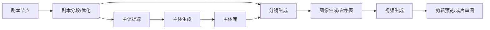

# AniShort Academy P0 视频深度审计记录

版本：20260701-113258
范围：Academy P0 12 个教程视频，合计 8759 秒（约 2 小时 25 分 59 秒）
目标：从教程画面、Academy API、前端资源常量中提取可落地的产品能力、创作流程、节点行为和开发验收依据。

## 1. 采集方法与证据

### 1.1 数据来源

- Academy 页面：`https://anishort.ai/academy`
- 教程列表 API：`GET https://anishort.ai/server/sys/products?menu_id=46&page_num=1&page_size=100`
- 分类 API：`GET https://anishort.ai/server/setting/menu/46`
- 前端资源：`work/anishort-current/js/*`
- P0 清单：`work/academy-audit-20260701-113258/tmp/p0-manifest.json`
- 抽帧报告：`work/academy-audit-20260701-113258/tmp/p0-sampling-report.json`
- Contact sheets：`work/academy-audit-20260701-113258/contact-sheets/`
- 关键帧：`work/academy-audit-20260701-113258/frames/`

### 1.2 采样说明

- 本轮对 P0 12 个视频全部完成远程 CDN 抽帧，无失败。
- 每个短视频保留 8 张关键帧，长视频保留 13-37 张关键帧。
- 第一条长视频 `基础短剧工作流` 保留 37 张图，覆盖从剧本、主体、分镜、图像、视频到后段节点的主要章节。
- 当前环境没有 Whisper / faster-whisper，未做完整逐字音频转写；结论以画面 UI、教程字幕、Academy 描述和前端资源常量为依据。后续如需要逐字稿，应补充 ASR 任务并生成逐字时间轴。

## 2. P0 视频清单与优先级

| P0 | ID | 标题 | 分类 | 时长 | 抽帧数 | 主要价值 |
| --- | ---: | --- | --- | --- | ---: | --- |
| 1 | 37 | 基础短剧工作流 | 全流程教程 | 46:40 | 37 | 最完整的剧本到视频主链路 |
| 2 | 46 | AniShort最新工作流，必看最新教程！ | 基础教程 | 27:18 | 14 | 最新节点参数、AI 辅助改写、快速出片链路 |
| 3 | 36 | 画布工作区、节点介绍 | 全流程教程 | 20:12 | 13 | 画布、历史版本、节点库、节点交互 |
| 4 | 38 | 自由式短剧工作流 | 全流程教程 | 18:40 | 13 | 手动搭建/复用节点/自由创作 |
| 5 | 1 | AI短剧快速入门 | 入门 | 05:13 | 8 | 最短路径：节点到短剧成片 |
| 6 | 30 | Seedance2.0全流程讲解 | 入门 | 06:50 | 8 | Seedance2.0 视频模型流程 |
| 7 | 51 | 优化情节、智能分段、一键生成提示词 | 基础教程 | 03:30 | 8 | 剧本优化、智能分段、主体提示词 |
| 8 | 24 | 什么是主体、如何生成主体 | 基础教程 | 03:56 | 8 | 主体定义、主体生成、主体库 |
| 9 | 23 | 分镜制作解析 | 基础教程 | 04:36 | 8 | 分镜脚本、宫格图、视频提示词 |
| 10 | 57 | 3D导演台调整场景缩放比例与位置 | 功能教程 | 03:35 | 8 | 3D 导演台角色/场景比例与站位 |
| 11 | 42 | 场景图转换成720全景图 | 新功能 | 02:00 | 8 | 图像节点转全景、720 场景一致性 |
| 12 | 31 | 个人版与团队版区别 | 新功能 | 03:29 | 8 | 积分、模型权限、空间、协作 |

## 3. 整体工作流结论

### 3.1 三类创作路径

1. 基础短剧工作流
   - 适合新项目或标准短剧生产。
   - 由平台内置节点模板串联：剧本节点 -> 剧本分段 -> 主体提取 -> 主体生成 -> 主体库 -> 分镜生成 -> 图像生成 -> 视频生成。
   - 画面证据：`contact-sheets/01-37-基础短剧工作流.jpg`

2. 最新工作流
   - 重点是“更少手动配置、更高可控性”。
   - 视频中出现节点参数面板、AI 辅助改写、答案拷回剧本节点、手动补充参考与批量视频生成。
   - 画面证据：`contact-sheets/02-46-AniShort最新工作流-必看最新教程.jpg`

3. 自由式短剧工作流
   - 用户可以手动拖节点、连线、复用参考图、局部生成。
   - 不强制遵循固定模板，支持围绕已有素材构建角色、场景、分镜、视频节点。
   - 画面证据：`contact-sheets/04-38-自由式短剧工作流.jpg`

### 3.2 标准主链路

### 3.3 生产口径

- 主体包含角色、场景、道具，不只是人物。
- 主体生成前需要先提取/整理主体提示词；生成后需要命名并进入主体库。
- 分镜不是单张图，而是 Scene 级结构化输出：镜头表、宫格图提示词、视频提示词、旁白和音画同步说明。
- 视频生成以首帧/尾帧、参考图/参考视频、文本提示词为不同输入模式。
- 3D 导演台用于解决场景比例、角色站位、机位、构图可控性问题。
- 720 全景图用于解决场景一致性和角色站位，不只是一个普通图像编辑工具。

## 4. 节点与功能细节

### 4.1 画布工作区

确认能力：

- 左侧有画布/节点导航，支持历史版本回退、搜索节点、定位节点。
- 中央为无限画布，节点有输入/输出端口，端口按数据类型区分颜色。
- 底部有缩放、选择、移动、适应视图、对齐、快捷键、添加节点、主体库、资源备份、全局风格入口。
- 右键菜单可创建节点和执行节点级命令。
- 节点支持复制、撤销、回退、全屏查看、参数面板、历史结果。
- 节点分组可作为批量工作流容器，基础教程中可见角色生成组、场景生成组、道具生成组、分镜/视频组。

关键证据：

- `frames/03-36-画布工作区-节点介绍/03-01-21.jpg`：历史版本入口。
- `frames/03-36-画布工作区-节点介绍/03-03-14.jpg`：空白处右键创建节点。
- `frames/03-36-画布工作区-节点介绍/03-20-04.jpg`：快捷键撤销/恢复。

### 4.2 剧本节点

确认能力：

- 承载原始剧本、优化后剧本和后续节点的文本输入。
- 支持全屏文本编辑器，长文本内容适合在编辑器中处理。
- 最新工作流里出现“AI 返回答案后拷贝到剧本节点”的操作，说明剧本节点应允许手动粘贴/覆盖/版本管理。
- 剧本节点是剧本分段、主体提取、分镜生成的上游。

开发要求：

- 剧本节点需要保留原文、优化文、确认文三层状态。
- 应提供全屏编辑、复制、粘贴、历史版本、字数统计、保存状态。
- 应支持把 AI 助手/其他节点输出回填为当前剧本版本。

### 4.3 剧本分段/优化节点

确认能力：

- 支持“优化情节、智能分段、一键生成提示词”。
- 智能分段和固定分段都存在。
- Academy 描述明确：剧本智能分段成 1-15 秒，AI 优化剧本，人物/场景/道具提示词一键生成。
- 节点输出可以继续作为主体提取、分镜生成、视频提示词生成的输入。

关键参数：

- 分段模式：智能分段、固定分段。
- 分段时长：1-15 秒区间。
- 剧本优化：整理原剧本、优化情节、保留核心剧情。
- 提示词生成：人物、场景、道具提示词。
- 输出回写：可把整理/优化结果回填到剧本节点。

关键证据：

- `frames/07-51-优化情节-智能分段-一键生成提示词/07-00-53.jpg`：剧本整理/优化列表。
- `frames/07-51-优化情节-智能分段-一键生成提示词/07-01-30.jpg`：主体提取与剧本分段联动。
- `frames/06-30-Seedance2.0全流程讲解/06-02-56.jpg`：分两段，每段 15 秒的示例。

### 4.4 主体提取节点

确认能力：

- 从剧本中提取角色、场景、道具。
- 负责主体库查重或校验。
- 输出结构化主体表，并标记主体库状态。
- 在基础短剧工作流中，主体提取之后会进入主体生成节点。

开发要求：

- 输出字段至少包含：类别、名称、别名/称呼、外观特征、道具/场景描述、主体库状态、说明。
- 需要支持“一名角色多个名字”的归并逻辑。
- 需要支持已有主体库匹配、缺失主体提示、跨项目/跨团队主体复用。

关键证据：

- `frames/01-37-基础短剧工作流/01-07-28.jpg`：主体提取后的表格化结果。
- `frames/09-23-分镜制作解析/09-02-24.jpg`：分镜资产汇总表包含主体库状态。

### 4.5 主体生成节点

确认能力：

- 主体生成是基于主体提取结果继续生成设定图/主体图。
- 角色、场景、道具都可以生成主体。
- 主体生成后需要命名，随后可加入画布底部菜单中的主体库。
- 主体图会作为后续分镜图和视频生成的参考素材。

主体类型：

- 角色主体：多角度/多视图，强调人物一致性。
- 场景主体：场景设定图，后续可转全景。
- 道具主体：道具设定图，常见为多视图或三视图。
- 音色主体：教程列表中存在“如何让人物的音色始终不变”，说明声音也可与人物主体绑定。

关键证据：

- `frames/08-24-什么是主体-如何生成主体/08-01-41.jpg`：生成角色设定图并命名。
- `frames/08-24-什么是主体-如何生成主体/08-02-03.jpg`：主体库入口。
- `frames/01-37-基础短剧工作流/01-20-04.jpg`：右键创建主体/加入主体库。

### 4.6 分镜生成节点

确认能力：

- 分镜是制作中关键步骤，输出不是单一提示词。
- 支持将每一场戏/段落转成 Scene 结构。
- 短段落倾向四宫格，长段落倾向九宫格；前端资源中存在 4 宫格与 9 宫格强约束模板。
- 输出包含分镜资产汇总表、出场角色、场景、道具、镜头数、预估时长、宫格图提示词、视频提示词、旁白、负面提示词、音画同步规范。

关键证据：

- `frames/09-23-分镜制作解析/09-00-44.jpg`：分镜生成节点连接上游。
- `frames/09-23-分镜制作解析/09-01-09.jpg`：四宫格/九宫格分镜图。
- `frames/09-23-分镜制作解析/09-02-24.jpg`：分镜资产汇总表。
- 前端资源：`work/anishort-current/js/Index-C-iskkoE.js` 中可见 `SMART_STORYBOARD_GRID_SPECS`，包含四宫格/九宫格约束。

开发要求：

- Scene 输出必须结构化，不能只输出自然语言。
- Scene 应具备 `scene_no`、`duration_seconds`、`grid_type`、`shot_count`、`cast`、`scene`、`props`、`image_prompt`、`video_prompt`、`narration`、`negative_prompt`、`av_sync_prompt`。
- 智能分段时需根据每段时长推导四宫格/九宫格。

### 4.7 图像生成节点

确认能力：

- 支持剧本/主体/分镜图输入。
- 支持参考图和主体库素材输入。
- 支持图像模型选择、比例/分辨率、生成历史、全屏预览。
- 前端资源中确认图像模型列表。

模型列表（前端资源确认）：

| 模型 key | 展示名 | 描述 |
| --- | --- | --- |
| `gemini-3-pro-image-preview` | Banana Pro | 世界最强图像生成模型 |
| `gemini-3.1-flash-image-preview` | Banana 2.0 | 谷歌香蕉最新最强模型 |
| `doubao-seedream-5-0-260128` | Seedream 5.0 | 即梦旗下最新图像模型 |
| `doubao-seedream-4-5-251128` | Seedream 4.5 | 即梦旗下图像模型 |
| `Midjourney-v7` | Midjourney-v7 | Midjourney 图像模型 |
| `Midjourney-v8` | Midjourney-v8 | Midjourney 图像模型 |
| `gpt-image-2` | GPT-image2-low | OpenAI 图像模型 |
| `gpt-image-2-medium` | GPT-image2-medium | OpenAI 图像模型 |
| `gpt-image-2-high` | GPT-image2-high | OpenAI 图像模型 |

推荐口径：

- 默认/推荐：Banana Pro。
- 批量高性价比：Seedream 5.0 / Seedream 4.5。
- 高审美尝试：Midjourney-v7/v8。
- 文本和复杂指令遵循：GPT-image2-medium/high。

### 4.8 视频生成节点

确认能力：

- 支持文本生成、首帧/尾帧、参考图、参考视频、视频编辑等模式。
- 支持批量生成、视频时长、分辨率、音效开关、任务轮询、失败提示、积分预检查。
- Seedance2.0 教程中强调全流程生成，最新工作流中出现批量生成视频节点。

模型列表（前端资源确认）：

| 模型 key | 展示名 | 描述 |
| --- | --- | --- |
| `veo3.1` | VEO 3.1 | 谷歌视频模型 |
| `veo3.1-pro` | VEO 3.1 Pro | 谷歌旗舰视频模型 |
| `seedance` / `doubao-seedance-1-5-pro-251215` | 即梦 1.5 | 视频模型 |
| `doubao-seedance-2-0-260128` | Seedance 2.0 | 主推视频模型 |
| `doubao-seedance-2-0-fast-260128` | Seedance 2.0 fast | 快速视频模型 |
| `doubao-seedance-2-0-mini-260615` | Seedance 2.0 mini | 轻量视频模型 |
| `kling` / `kling-v2-6` | 可灵 2.6 | 快手视频模型 |
| `kling-v3` | 可灵 V3 | 快手视频模型 |
| `kling-v3-omini` | 可灵 V3 Omini | 参考/视频编辑能力 |
| `kling-v3-motion-control` | 可灵V3 动作迁移 | 参考图+参考视频 |
| `sora-2` | Sora 2 | OpenAI 视频模型 |
| `viduq3-pro` | Vidu Q3 Pro | 生数科技视频模型 |
| `viduq3-turbo` | Vidu Q3 Turbo | 生数科技视频模型 |
| `grok-video-3` | Grok Video 3 | xAI 视频模型 |
| `wan-2-7` | Wan 2.7 | 阿里万象视频模型 |
| `happyHorse-1.0` | HappyHorse 1.0 | 阿里快乐马视频模型 |

推荐口径：

- 短剧主线推荐：Seedance 2.0。
- 快速预览/批量试错：Seedance 2.0 fast / mini。
- 参考视频编辑或动作迁移：可灵 V3 Omini / 可灵V3 动作迁移。
- 高质量探索：VEO 3.1 / VEO 3.1 Pro。

关键限制（前端资源确认）：

- 可灵 V3 Omini 的视频编辑模式必须连接参考视频。
- 动作迁移模式需要同时连接参考图片和参考视频。
- 部分视频编辑模式要求参考视频时长在 3-15 秒或 3-30 秒范围。
- 首尾帧模式连接尾帧时需要同时连接首帧。

### 4.9 720 全景图节点/命令

确认能力：

- 场景图可以通过图像节点顶部或右键菜单转换成 720 全景图。
- 右键菜单中可见“全景生成”入口。
- 生成面板可选择图像模型和分辨率。
- 输出可双击全屏查看。

关键证据：

- `frames/11-42-场景图转换成720全景图/11-00-06.jpg`：图像节点顶部全景命令。
- `frames/11-42-场景图转换成720全景图/11-00-41.jpg`：右键节点动作菜单中的全景生成。
- `frames/11-42-场景图转换成720全景图/11-01-13.jpg`：生成后双击全屏查看。

产品定位：

- 不是普通图片扩展，而是服务于 3D/场景一致性的生产节点。
- 目标是解决同一场景多镜头中的环境连续性和角色站位。

### 4.10 3D 导演台

确认能力：

- 3D 导演台是单独创作入口，不只是画布内普通面板。
- 可在 3D 场景中加载场景图/全景背景、添加角色白模、调整比例、位置、视角。
- 右侧有对象/角色资源库、属性面板、颜色/参数工具。
- 底部有镜头/视角缩略条。
- 重点解决人物比例、场景缩放、角色站位和机位问题。

关键证据：

- `frames/10-57-3D导演台调整场景缩放比例与位置/10-00-06.jpg`：3D 场景视口。
- `frames/10-57-3D导演台调整场景缩放比例与位置/10-01-13.jpg`：拖拽人物白模进入场景。
- `frames/10-57-3D导演台调整场景缩放比例与位置/10-01-52.jpg`：多人物比例与站位。

开发要求：

- 需要独立路由或弹窗级全屏编辑器。
- Three.js 视口必须支持背景、角色、场景物件、TransformControls、相机视角、缩放/位移/旋转、快照输出。
- 画布节点需要保存导演台场景状态和输出参考图。

### 4.11 个人版与团队版

确认能力：

- 个人版积分属于个人，个人项目只能个人访问，协作者需要链接或单独权限。
- 团队版由团队创建者充值，并给成员分配积分。
- 团队空间与个人空间分离。
- 团队项目支持成员共同创作，团队成员可在团队项目中查看和参与。
- 模型权限不同：画面文字显示文本图片视频模型可用范围，Seedance2.0 在个人版和团队版中均可试用/生成。

关键证据：

- `frames/12-31-个人版与团队版区别/12-00-17.jpg`：充值积分差异。
- `frames/12-31-个人版与团队版区别/12-00-33.jpg`：模型权限。
- `frames/12-31-个人版与团队版区别/12-00-52.jpg`：项目协作差异。
- `frames/12-31-个人版与团队版区别/12-02-07.jpg`：团队充值弹窗。

## 5. 对 PRD/WBS 的影响

必须补充或强化：

- Academy/教程中心不是可选运营页，它承载了工作流培训和功能发布，需要进入产品架构。
- 剧本分段节点必须包含智能分段、固定分段、情节优化、主体提示词生成。
- 主体系统必须覆盖角色、场景、道具、音色，并支持主体库状态校验。
- 分镜节点必须输出 Scene 结构、宫格图提示词、视频提示词、旁白、负面提示词、音画同步。
- 图像节点必须支持“全景生成”动作，输出 720 全景图。
- 视频节点必须实现多输入模式和模型限制，不能只做 prompt -> video。
- 3D 导演台必须作为独立工作台实现，支持场景比例、人物白模、站位和机位。
- 团队版需要覆盖积分分配、项目协作、空间隔离、模型权限。

## 6. 待补充项

- 本轮未逐字转写长视频音频，部分参数名仍需后续 ASR 或继续逐帧放大核验。
- P0 未覆盖全部 38 个教程；P1 建议继续处理：画面风格节点、图像节点打光、多节点批量操作、首尾帧截取、字幕擦除、超分、历史版本、主体跨项目复用、人物一致性。
- 若后续开发时遇到 PRD/验收描述不清晰，必须回到原站同功能用 Chrome/CDP 核验，不允许自行猜测补齐。
